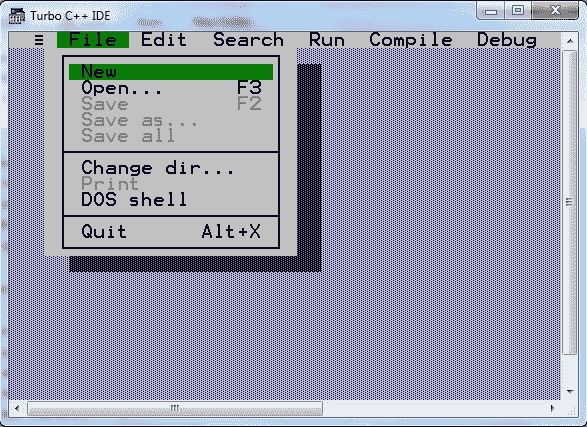
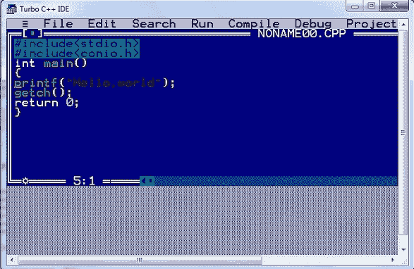
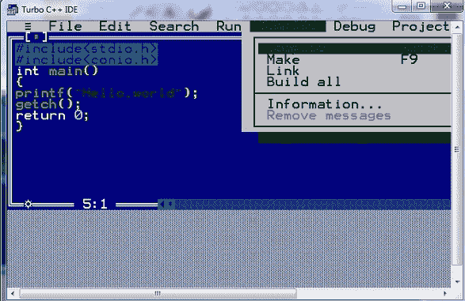
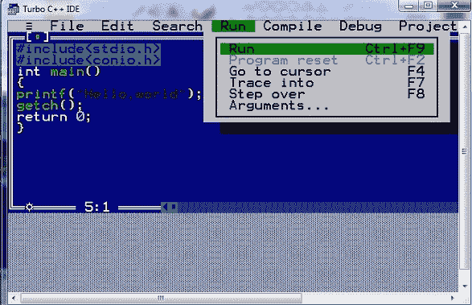
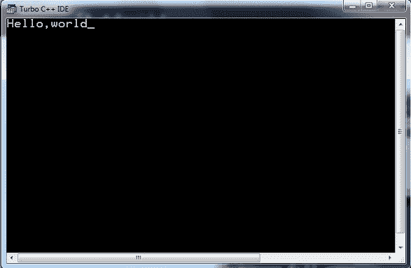

# 编译并运行 C 程序

> 原文：<https://www.studytonight.com/c/compile-and-run-c-program.php>

要编译运行一个 [C 语言程序](https://www.studytonight.com/c/first-c-program.php)，需要一个 C 编译器。一个**编译器**是一个用来编译和执行程序的软件。要在计算机/笔记本电脑中设置 C 语言编译器，有两种方法:

1.  下载一个成熟的集成开发环境，如 Turbo C++ 或微软 Visual C++ 或 DevC++，它附带一个 C 语言编译器。

2.  或者，您可以使用任何文本编辑器分别编辑程序文件和下载 C 编译器，然后使用命令行运行 C 程序。

如果你还没有为 C 语言安装 IDE 按照这个分步指南 **[为 C 语言安装 Turbo c++](https://www.studytonight.com/c/installing-c-language-compiler-and-ide.php)**

## 使用集成开发环境-涡轮增压

我们会推荐你使用 **Turbo C 或者 Turbo C++** IDE，这是 C 编程最古老的 IDE。它可以在网上免费获得，对初学者很有好处。

**第一步:**打开 turbo C IDE(集成开发环境)，点击**文件**，然后点击**新增**



**第二步:**写一个我们在上一篇文章中创建的 Hello World 程序- **[C Hello World 程序](http://www.studytonight.com/c/first-c-program.php)** 。



**第三步:**点击**编译**菜单，然后点击**编译**选项，或者按键按 **Alt + F9** 编译代码。



**第四步:**点击**运行**或按 **Ctrl + F9** 运行代码。是的，首先编译 C 程序以生成目标代码，然后运行该目标代码。



**第五步:**输出在这里。



## 不使用任何集成开发环境运行 C 程序

如果你不想设置 IDE，更喜欢老派的方式，那就从 GCC 网站[https://gcc.gnu.org/install/](https://gcc.gnu.org/install/)下载名为`gcc`的 C 编译器

一旦你下载并安装了`gcc`编译器，你所要做的就是，**打开任意一个文本编辑器**，复制并粘贴 [C Hello World Program](https://www.studytonight.com/c/first-c-program.php) 的 C 程序代码，并将其以 **helloworld.c** 的名称保存，就像你以名称保存的任何其他文件一样。

现在，打开**命令提示符或终端**(如果使用的是 Ubuntu 或 Mac OS)，转到保存 **helloworld.c** 程序文件的目录。

键入命令`gcc hello.c`编译代码。这将编译代码，如果没有错误，那么它将产生一个名为 **a.out** (默认名称)的输出文件

现在，要运行程序，输入`./a.out`你会看到**你好，世界**显示在你的屏幕上。

```cpp
$ gcc hello.c
$ ./a.out
```

你好，世界

## C 语言编译和运行的区别？

你一定在想为什么这是一个两步的过程，首先，我们编译代码，然后运行代码。我们对 Turbo C 做了同样的事情，对命令行或终端也是如此。

嗯，**编译**是编译器检查**程序语法是否正确的过程**，语法没有错误，如果代码没问题就把 C 语言源代码转换成机器可理解的目标代码。

当我们**运行一个编译好的程序**时，运行的只是已经编译好的代码。

当我们使用命令行运行一个 C 程序时，这种差异是显而易见的。当你编译代码时，一个**。out** 文件生成，然后运行执行程序。

一次**。out** 文件生成，然后你在源代码文件中对你的程序做任何**的修改，你就要再次**编译代码**，否则，**。out 文件将有旧的源代码**并将继续运行旧程序本身。**

* * *

## 常见问题解答

### 1.你通过编译的过程理解了什么？

这是一个编译器检查程序语法是否正确的过程。如果在语法中发现任何错误，那么它将抛出错误。编译时抛出的错误称为**编译时错误**。

### 2.命名 Turbo C 中用来编译代码的键。

**ALT + F9** 在 turbo C 中为了编译代码而使用。

### 3.C 程序是如何运行的？

在 C 程序的编译和执行过程中，编译器生成与 **C 程序**文件同名但扩展名不同的输出文件。那个。c 扩展文件称为保存**程序**代码的源文件。现在，当我们编译文件时，然后 **C** 编译器寻找错误。

### 4.在哪里可以编写和运行 C 程序？

您可以按照以下步骤使用集成开发环境编写和运行 C 程序:

*   第一步:打开 turbo **C** IDE(集成开发环境)，点击**文件**，然后点击**新建**。

*   第二步:**编写**C 程序代码。

*   第三步:点击**编译**或按 **Alt + F9** 到**编译**代码。

*   第四步:点击**运行**或按 **Ctrl + F9** 运行**代码。**

*   第五步:turbo C 将打开控制台，向您显示程序的输出。

* * *

## 结论

本教程讲述了如何使用一个名为 Turbo C 的集成开发环境运行和编译任何 C 程序。我们还介绍了如何在不使用任何集成开发环境的情况下完成这项工作。

* * *

* * *