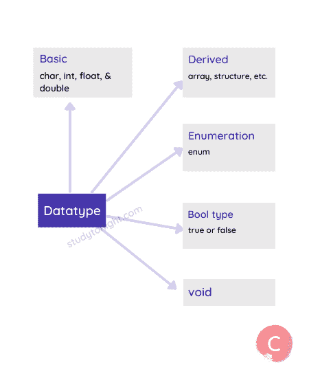
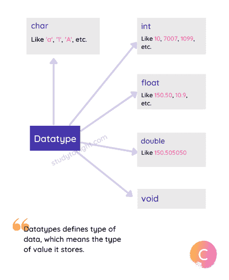

# 理解 C 数据类型

> 原文:[https://www.studytonight.com/c/datatype-in-c.php](https://www.studytonight.com/c/datatype-in-c.php)

顾名思义，数据类型定义了正在使用的数据类型。每当我们[定义一个变量](http://www.studytonight.com/c/variables-in-c.php)或者在 C 语言程序中使用任何数据时，我们都必须指定数据的类型，这样编译器就知道需要什么类型的数据。

例如，您可能想要使用像 **1** 、 **2** 、 **100** 这样的**数字，或者像 **99.95** 、 **10.5** 这样的**小数点数字，或者像**【今晚学习】**这样的**文本**，所有这些值都是由 C 语言编译器**以不同方式处理的******

在本教程中，我们已经解释了数据类型，对于代码示例，使用 C 数据类型教程来检查[。](https://www.studytonight.com/c/using-datatypes-examples.php)

## 数据类型

大体上，在 C 语言中有 5 种不同的数据类型，它们是:

| 类型 | 例子 |
| --- | --- |
| 基础 | 字符、整数、浮点、双精度。 |
| 得到 | 数组、结构、并集等。 |
| 列举 | 枚举数 |
| 布尔类型 | 对还是错 |
| 空的 | 空值 |



## 主要数据类型:

C 语言有 5 种基本数据类型，它们是:

1.  **字符** - ASCII 字符集或一般单个字母表，如**【a】****【B】**等。

2.  **整数** -用于存储整数，如 **1** 、 **2** 、 **100** 、 **1000** 等。

3.  **浮点** -小数点或实数值，如 **99.9** 、 **10.5** 等。

4.  **双** -整数或浮点类型中不允许的非常大的数值。

5.  **Void** -这表示没有值。这种数据类型在我们定义函数时最常用。

有不同的关键字来指定这些数据类型，关键字有:

| 数据类型 | 关键字 |
| --- | --- |
| 性格；角色；字母 | `char` |
| 整数 | `int` |
| 浮点 | `float` |
| 两倍 | `double` |
| 空的 | `void` |



每个数据类型都有一个以**位/字节**定义的**大小**，并且这些数据类型可以保存的值有一个**范围**。

## 不同数据类型的大小

不同数据类型的大小取决于编译器和处理器类型，简而言之，它取决于运行 C 语言的计算机和安装的 C 编译器版本。

### 字符是 1 字节

`char`数据类型为 **1 字节**或 **8 位**。这基本上是一样的，不受处理器或所用编译器的影响。

### int 可以是 2 字节/4 字节

有一个非常简单的方法来记住`int`数据类型的大小。`int`数据类型的大小通常等于程序执行环境的字长。简单来说，对于 **16 位环境**，`int`为 **16 位**或 **2 字节**，对于 **32 位环境**，`int`为 **32 位**或 **4 字节**。

### 浮点是 4 字节

`float`数据类型为 **4 字节**或 **32 位**大小。是**单精度数据类型**，用于保存十进制值。它用于存储大值。

与`double`相比，`float`是一个更快的数据类型，因为`double`数据类型处理非常大的值，因此速度很慢。

### double 是 8 字节

`double`数据类型为 **8 字节**或 **64 位**大小。它可以存储的值是浮点数据类型可以存储的值的两倍，因此被称为`double`。

在这 64 位中， **1 位**用于**符号**表示， **11 位**用于**指数**，其余 **52 位**用于**尾数**。

`double`数据类型大约可以容纳 **15 到 17 位数字**，在小数之前和小数之后。

### void 为 0 字节

`void`数据类型没有任何意义，因此它没有大小。

| **好阅读:[理解什么是位和字节](https://www.studytonight.com/post/understanding-what-are-bits-and-bytes-and-the-difference-between-them)** |

在讨论这些数据类型的取值范围之前，还有一个更重要的概念需要学习，那就是**数据类型修饰符**。

## 数据类型修饰符:

在 C 语言中，有 **4 个数据类型修饰符**，它们与基本数据类型一起使用来进一步对它们进行分类。

比如你说，有操场，对方就知道有操场，但是你可以具体一点说，有板球操场或者足球操场，这样对对方来说就更清楚了。

同样，C 语言中也有修饰符，以**使主数据类型更具体**。

以下是修饰语:

1.  签名

2.  无符号的

3.  长的

4.  短的

顾名思义，有符号和无符号用于表示任何数据类型的**有符号(+和-)** 和**无符号(仅+)值**。而**长**和**短**会影响任何数据类型的值的**范围。**

例如，**有符号 int** 、**无符号 int** 、**短 int** 、**长 int** 等。都是 C 语言中有效的数据类型。

现在让我们看看不同数据类型的范围，这些数据类型是由 5 种主要数据类型以及上面指定的修饰符形成的。

## 数据类型值范围

在下表中，我们有 C 语言中不同数据类型的范围。

| 类型 | 典型位大小 | 最小范围 | 格式规范 |
| --- | --- | --- | --- |
| `char` | eight | -127 到 127 | `%c` |
| `unsigned` `char` | eight | 0 到 255 | `%c` |
| `signed` `char` | eight | -127 到 127 | `%c` |
| `int` | 16 岁或 32 岁 | -32，767 至 32，767 | `%d`、`%i` |
| `unsigned` `int` | 16 岁或 32 岁 | 0 至 65，535 | `%u` |
| `signed` `int` | 16 岁或 32 岁 | 与 int 相同 | `%d`、`%i` |
| `short` `int` | Sixteen | -32，767 至 32，767 | `%hd` |
| `unsigned` `short` `int` | Sixteen | 0 至 65，535 | `%hu` |
| `signed` `short` `int` | Sixteen | 与短整型相同 | `%hd` |
| `long` `int` | Thirty-two | -2，147，483，647 至 2，147，483，647 | `%ld`、`%li` |
| `long` `long` `int` | Sixty-four | -(2 <sup>63</sup> - 1)至 2 <sup>63</sup> - 1(由 C99 标准增加) | `%lld`、`%lli` |
| `signed` `long` `int` | Thirty-two | 与 long int 相同 | `%ld`、`%li` |
| `unsigned` `long` `int` | Thirty-two | 0 至 4，294，967，295 | `%lu` |
| `unsigned` `long` `long` `int` | Sixty-four | 2 <sup>64</sup> - 1(由 C99 标准增加) | `%llu` |
| `float` | Thirty-two | 1E-37 至 1E+37，精度为六位数 | `%f` |
| `double` | Sixty-four | 1E-37 至 1E+37，精度为十位数 | `%lf` |
| `long` `double` | Eighty | 1E-37 至 1E+37，精度为十位数 | `%Lf` |

如上表所示，数据类型和修饰符的不同组合会改变值的范围。

当我们想要打印任何数据类型的任何变量的值时，我们必须在`printf()`语句中使用**格式说明符**。

### 如果该值超出范围会发生什么？

嗯，如果你试图给任何超过允许值范围的数据类型赋值，那么 C 语言编译器会给出一个错误。下面是一个简单的代码示例来说明这一点，

```cpp
#include <stdio.h>

int main() {
   // allowed value up to 65535
   unsigned short int x = 65536;

   return 0;
}
```

警告:大整数隐式截断为无符号类型[-Overflow]
无符号短 int x = 65536
^

[运行代码→](https://www.studytonight.com/code/playground/c/?id=1UZFrt)

当使用一个**类型修饰符而没有任何数据类型**时，则`int`数据类型被设置为默认数据类型。所以，`unsigned`表示`unsigned``int``signed`表示`signed``int``long`表示`long``int``short`表示`short` `int`。

## `signed``unsigned`是什么意思？

这解释起来有点棘手，但让我们试试。

简单来说，`unsigned`修饰词表示**所有正值**，而`signed`修饰词表示**正负值**。

当编译器获得一个数值时，它将该值转换为二进制数，这意味着 0 和 1 的组合。比如二进制的 **32767** 就是**011111111 111111**，二进制的 **1** 就是 **01(或者 0001)** ， **2** 就是 **0010** 等等。

在**有符号整数**的情况下，**最高位**或左边第一个数字(二进制)用作**符号标志**。如果**标志为 0** ，则数字为**正**，如果为 **1** ，则数字为**负**。

因为一位用于显示数字是正的还是负的，所以少了一位来表示数字本身，因此范围更小。

对于**符号 int** ，**11111111111 111111 表示-32，767** ，由于第一位是**符号标志**，将其标记为负数，其余表示数字。鉴于在**无符号整数**的情况下，**1111111111**是指 **65，535** 。

## 派生数据类型:

虽然有 5 种主要的数据类型，但是在 C 语言中也有一些派生的数据类型用于存储复杂的数据。

派生数据类型只不过是主数据类型，但有点扭曲或组合在一起，就像一个 **[数组](https://www.studytonight.com/c/arrays-in-c.php)****[结构](https://www.studytonight.com/c/structures-in-c.php)****[并集](https://www.studytonight.com/c/unions-in-c.php)**和 **[指针](https://www.studytonight.com/c/pointers-in-c.php)** 。这些将在后面详细讨论。

## 结论:

在下一个教程中，我们将学习变量，在这里，您将学习数据类型的实际用法，以及 man 代码示例。所以我们继续吧。

* * *

* * *