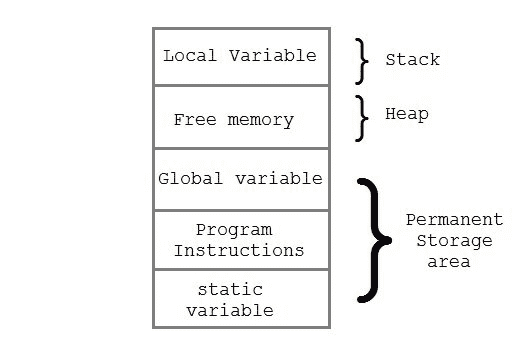

# C 语言中的动态内存分配

> 原文:[https://www . study south . com/c/dynamic-memory-allocation-in-c . PHP](https://www.studytonight.com/c/dynamic-memory-allocation-in-c.php)

运行时分配内存的过程称为**动态内存分配**。被称为**内存管理功能**的库例程用于在程序执行期间分配和释放内存。这些函数在 **stdlib.h** 头文件中定义。

| 功能 | 描述 |
| `malloc()` | 分配请求的字节大小，并返回指向分配空间的第一个字节的 void 指针 |
| `calloc()` | 为元素数组分配空间，将它们初始化为零，然后返回指向内存的 void 指针 |
| `free` | 释放以前分配的内存 |
| `realloc` | 修改以前分配的空间大小 |

* * *

## 内存分配过程

**全局**变量、`static`变量和程序指令在**永久**存储区获得内存，而**局部**变量存储在名为**堆栈**的存储区。

这两个区域之间的内存空间称为**堆**区域。该区域用于程序执行期间的动态内存分配。堆的大小不断变化。



* * *

## 分配内存块

`malloc()`函数用于在运行时分配内存块。该函数保留给定大小的内存块，并返回类型为`void`的**指针**。这意味着我们可以使用类型转换将它分配给任何类型的指针。如果它未能按照指定分配足够的空间，它将返回一个`NULL`指针。

**语法:**

```cpp
void* malloc(byte-size)
```

* * *

### 举例时间:malloc()

```cpp
int *x;
x = (int*)malloc(50 * sizeof(int));     //memory space allocated to variable x
free(x);    //releases the memory allocated to variable x
```

`calloc()`是另一个内存分配函数，用于在运行时分配内存。`calloc`函数通常用于为派生数据类型分配内存，如**[数组和](structures-in-c.php)** 结构。如果未能按规定分配足够的空间，则返回一个`NULL` [指针](pointers-in-c.php)。

**语法:**

```cpp
void *calloc(number of items, element-size)
```

* * *

### 举例时间:卡洛克()

```cpp
struct employee
{
    char *name;
    int salary;
};
typedef struct employee emp;
emp *e1;
e1 = (emp*)calloc(30,sizeof(emp));
```

`realloc()`改变已经动态分配给变量的内存大小。

**语法:**

```cpp
void* realloc(pointer, new-size)
```

* * *

### 一个例子的时间:realloc()

```cpp
int *x;
x = (int*)malloc(50 * sizeof(int));
x = (int*)realloc(x,100);   //allocated a new memory to variable x
```

* * *

### `malloc()`和`calloc()`的区别

| 卡洛克（） | malloc() |
| --- | --- |
| calloc()用 0 值初始化分配的内存。 | malloc()用垃圾值初始化分配的内存。 |
| 参数数量为 2 | 参数数量为 1 |
| **语法:**(cast_type *)calloc(blocks，size _ of _ block)； | **语法:**(cast _ type *)malloc(Size _ in _ bytes)； |

* * *

### 表示动态内存分配的程序(使用 calloc())

```cpp
#include <stdio.h>
#include <stdlib.h>

int main()
{
    int i, n;
    int *element;

    printf("Enter total number of elements: ");
    scanf("%d", &n);

    /*
        returns a void pointer(which is type-casted to int*)
        pointing to the first block of the allocated space
    */
    element = (int*) calloc(n,sizeof(int)); 

    /*
        If it fails to allocate enough space as specified, 
        it returns a NULL pointer.
    */
    if(element == NULL) 
    {
        printf("Error.Not enough space available");
        exit(0);
    }

    for(i = 0; i < n; i++)
    {
        /*
            storing elements from the user 
            in the allocated space
        */
       scanf("%d", element+i); 
    }
    for(i = 1; i < n; i++)
    {
       if(*element > *(element+i))
       {
            *element = *(element+i);
        }
    }

    printf("Smallest element is %d", *element);

    return 0;
}
```

输入元素总数:5 4 2 1 5 3 最小元素为 1

* * *

* * *