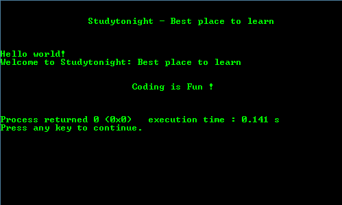

# C 语言中的你好世界程序

> 原文：<https://www.studytonight.com/c/programs/basic/hello-world>

下面是一个用 C 语言打印 Hello World 的简单程序。

Hello World 程序是任何编程语言中的第一个程序，它的创建是为了检查基本设置和安装是否成功完成。

```cpp
#include <stdio.h>

int main()
{
    printf("Hello World");
    return 0;
}
```

你好，世界

[运行代码→](https://www.studytonight.com/code/playground/c/?id=kB7XiP)

`printf()`是头文件 **stdio.h** 下的系统定义函数，用于将数据打印到屏幕上

让我们再看一个例子，我们将在控制台上打印更多的文本。

```cpp
#include <stdio.h>

int main()
{
    printf("\n\n\t\tStudytonight - Best place to learn\n\n\n");
    int num;
    printf("\nHello world!\nWelcome to Studytonight: Best place to learn\n");
    printf("\n\n\t\t\tCoding is Fun !\n\n\n");
    return 0;
}
```

### 输出:



`\n`用于将控件移动到下一行

`\t`用于给出水平制表符，即连续的五个空格

* * *

* * *