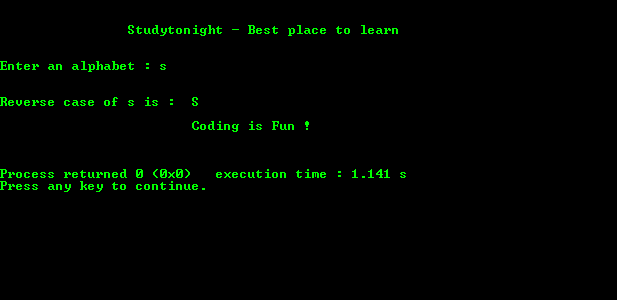

# 反转输入字符大小写的程序

> 原文:[https://www . study south . com/c/programs/basic/反转字符大小写](https://www.studytonight.com/c/programs/basic/reversing-case-of-character)

下面是一个反转输入字符大小写的程序。

`getchar()`类似于`scanf()`。

`islower()`是系统在 **ctype.h** 头文件下定义的检查字符是否小写的功能。

`toupper()`将输入参数转换为等效大写字符。

`putchar()`类似于`printf()`。

```cpp
#include<stdio.h>
#include<ctype.h> // to use system defined function islower & toupper

int main()
{
    printf("\n\n\t\tStudytonight - Best place to learn\n\n\n");

    char alphabet;
    printf("Enter an alphabet : ");
    putchar('\n');  // to move to next Line

    alphabet=getchar();

    printf("\n\nReverse case of %c is :  ",alphabet);

    if(islower(alphabet))
        putchar(toupper(alphabet));

    else 
        // must be an uppercase character
        printf("%c",tolower(alphabet)) ;

    printf("\n\n\t\t\tCoding is Fun !\n\n\n");
    return 0;
}
```

### 输出:



* * *

* * *