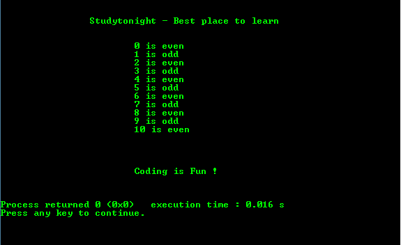
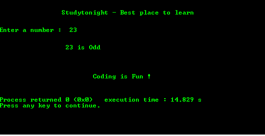

# 使用按位运算符检查奇数和偶数

> 原文：<https://www.studytonight.com/c/programs/numbers/checking-for-odd-or-even>

下面是一个使用按位运算符来查找数字是偶数还是奇数的程序。

如果整数 x 的二进制表示的最低有效位为 1，则`x&1`返回**真**。如果二进制序列中的最低有效位或最右边的位为 0，则返回**假**。

在一个整数的二进制表示中，如果 LSB 是 1，那么它是**奇数**，如果 LSB 是 0，那么它是**偶数**。

```cpp
#include<stdio.h>

int main()
{
    printf("\n\n\t\tStudytonight - Best place to learn\n\n\n");
    int x;
    for(x = 0; x <= 10; x++)
    {
        if(x&1) // if number is odd
            printf("\t\t\t%d is odd\n",x);
        else if(!(x&1)) // ! is used inside if to reverse the boolean value
            printf("\t\t\t%d is even\n",x);
    }

    printf("\n\n\n\n\t\t\tCoding is Fun !\n\n\n");
    return 0;
}
```

### 输出:



* * *

我们使用了一个简单的`for`循环来输入数字，并展示了如何使用 Bitwise 运算符。您可以使用`scanf()`从用户处获取输入，并使用相同的逻辑来查找输入的数字是奇数还是偶数。

## 不使用`%` (Mod)运算符检查输入数是奇数还是偶数

下面是一个不用`%` (Mod)运算符就能发现一个数是偶数还是奇数的程序。

```cpp
#include<stdio.h>

int main()
{
    printf("\n\n\t\tStudytonight - Best place to learn\n\n\n");
    int n;
    printf("Enter a number:  ");
    scanf("%d",&n);

    if((n/2)*2 == n)
        printf("\n\n\t\t %d is Even\n", n);
    else
        printf("\n\n\t\t %d is Odd\n", n);

    printf("\n\n\n\n\t\t\tCoding is Fun !\n\n\n");
    return 0;
}
```

### 输出:



* * *

* * *