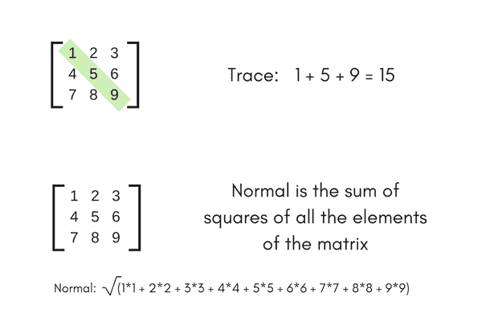
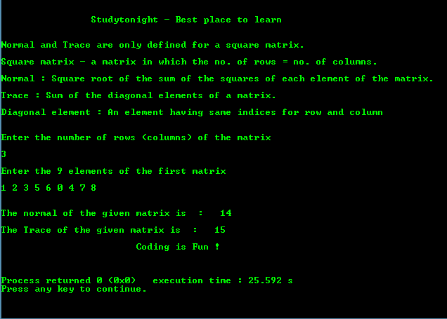

# 求方阵的法线和迹的程序

> 原文:[https://www . study south . com/c/programs/array/方阵的法线和轨迹](https://www.studytonight.com/c/programs/array/normal-and-trace-of-square-matrix)

需要记住的几个要点:

*   **正常**和**轨迹**仅针对正方形矩阵定义。
*   **方形矩阵**:其中，行数=列数的矩阵。
*   **正常**:矩阵各元素平方和的平方根。
*   **迹**:矩阵对角元素之和。
*   **对角线元素**:行和列具有相同索引的元素。

让我们举一个简单的例子来更好地理解这些术语:



下面是一个求方阵的法线和迹的程序。

```cpp
#include<stdio.h>
/* 
    to use the sqrt method to find 
    the square root of a number we include
    math.h header file
*/
#include<math.h>  

int main()
{
    printf("\n\n\t\tStudytonight - Best place to learn\n\n\n");

    int i, j, n, aj[10][10], sum = 0, sum1 = 0, a = 0, normal;

    printf("\nEnter the number of rows (columns) of the matrix: \n\n");
    scanf("%d", &n);

    printf("\nEnter the %d elements of the first matrix: \n\n", n*n);

    for(i = 0; i < n; i++)   // to iterate the rows
    {
        for(j = 0; j < n; j++)   // to iterate the columns
        {
            scanf("%d", &aj[i][j]);
            a = aj[i][j]*aj[i][j];  // finding square of each element
            sum1 += a;  // same as sum1 = sum1 + a
        }
    }
    normal = sqrt((double)sum1);    // typecasting to double value

    printf("\n\nThe normal of the given matrix is: %d", normal);
    for(i = 0; i < n; i++)
    {
        sum = sum + aj[i][i];   // sum of the diagonal elements
    }
    printf("\n\nThe Trace of the given matrix is: %d", sum);
    printf("\n\n\t\t\tCoding is Fun !\n\n\n");
    return 0;
}
```

### 输出:



* * *

* * *