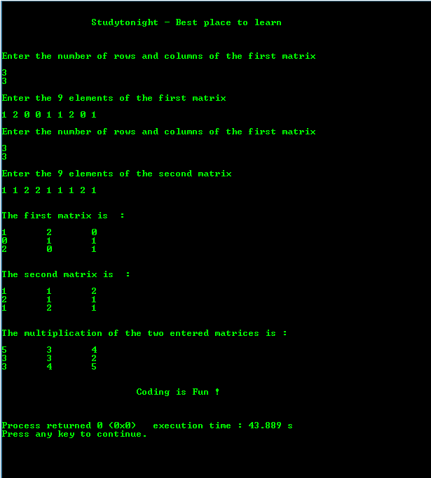

# 矩阵乘法的 C 程序

> 原文：<https://www.studytonight.com/c/programs/array/matrix-multiplication-program>

下面是一个关于矩阵乘法的程序。

只有当第一个矩阵的列数等于第二个矩阵的行数时，具有给定顺序的两个矩阵才能相乘。

```cpp
#include<stdio.h>

int main()
{
    printf("\n\n\t\tStudytonight - Best place to learn\n\n\n");

    int n, m, c, d, p, q, k, first[10][10], second[10][10], pro[10][10],sum = 0;

    printf("\nEnter the number of rows and columns of the first matrix: \n\n");
    scanf("%d%d", &m, &n);

    printf("\nEnter the %d elements of the first matrix: \n\n", m*n);
    for(c = 0; c < m; c++)   // to iterate the rows
        for(d = 0; d < n; d++)   // to iterate the columns
            scanf("%d", &first[c][d]);

    printf("\nEnter the number of rows and columns of the first matrix: \n\n");
    scanf("%d%d", &p, &q);

    if(n != p)
        printf("Matrices with the given order cannot be multiplied with each other.\n\n");

    else    // matrices can be multiplied
    {
        printf("\nEnter the %d elements of the second matrix: \n\n",m*n);

        for(c = 0; c < p; c++)   // to iterate the rows
            for(d = 0; d < q; d++)   // to iterate the columns
                scanf("%d", &second[c][d]);

        // printing the first matrix
        printf("\n\nThe first matrix is: \n\n");
        for(c = 0; c < m; c++)   // to iterate the rows
        {
            for(d = 0; d < n; d++)   // to iterate the columns
            {
                printf("%d\t", first[c][d]);
            }
            printf("\n");
        }

        // printing the second matrix
        printf("\n\nThe second matrix is: \n\n");
        for(c = 0; c < p; c++)   // to iterate the rows
        {
            for(d = 0; d < q; d++)   // to iterate the columns
            {
                printf("%d\t", second[c][d]);
            }
            printf("\n");
        }

        for(c = 0; c < m; c++)   // to iterate the rows
        {
            for(d = 0; d < q; d++)   // to iterate the columns
            {
                for(k = 0; k < p; k++)
                {
                    sum = sum + first[c][k]*second[k][d];
                }
            pro[c][d] = sum;    // resultant element of pro after multiplication
            sum = 0;    // to find the next element from scratch
            }
        }

        // printing the elements of the product matrix
        printf("\n\nThe multiplication of the two entered matrices is: \n\n");
        for(c = 0; c < m; c++)   // to iterate the rows
        {
            for(d = 0; d < q; d++)   // to iterate the columns
            {
                printf("%d\t", pro[c][d]);
            }
            printf("\n"); // to take the control to the next row
        }
    }
    printf("\n\n\t\t\tCoding is Fun !\n\n\n");
    return 0;
}
```

### 输出:



* * *

* * *