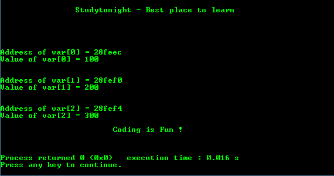
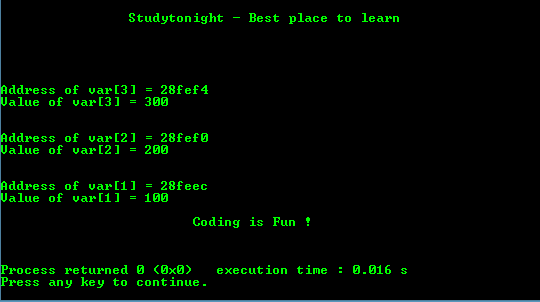

# 通过递增指针来访问数组元素(遍历数组)

> 原文：<https://www.studytonight.com/c/programs/pointer/pointer-increment-and-decrement>

数组的名称是指数组的**基地址**。

这里我们有一个教程来了解[指针算法是如何工作的？](/c/pointer-arithmetic-in-c.php)

下面是一个使用指针增量访问数组元素的程序。

```cpp
#include <stdio.h>

const int MAX = 3;  // Global declaration
int main()
{
	printf("\n\n\t\tStudytonight - Best place to learn\n\n\n");
	int var[] = {100, 200, 300};
    int i, *ptr;

    /* 
        storing address of the first element 
        of the array in pointer variable
    */
    ptr = var;

    for(i = 0; i < MAX; i++)
    {
        printf("\n\n\nAddress of var[%d] = %x ", i, ptr);
        printf("\nValue of var[%d] = %d ", i, *ptr);

       // move to the next location
        ptr++;
    }
	printf("\n\n\t\t\tCoding is Fun !\n\n\n");
    return 0;
}
```

### 输出:



* * *

## 通过递减指针遍历数组元素

下面是一个使用指针递减来访问数组元素的程序。

```cpp
#include <stdio.h>

const int MAX = 3;  // Global declaration
int main()
{
	printf("\n\n\t\tStudytonight - Best place to learn\n\n\n");
	int var[] = {100, 200, 300};
    int i, *ptr;

    /* 
        storing address of the last element 
        of the array in pointer variable
    */
    ptr = &var[MAX-1];

	for(i = MAX; i > 0; i--)
    {
    	printf("\n\n\nAddress of var[%d] = %x ", i, ptr);
        printf("\nValue of var[%d] = %d ", i, *ptr);

		// move to the previous location
        ptr--;
	}
	printf("\n\n\t\t\tCoding is Fun !\n\n\n");
    return 0;
}
```

### 输出:



* * *

* * *