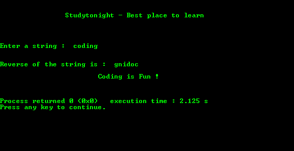

# 使用指针反转字符串的 C 程序

> 原文：<https://www.studytonight.com/c/programs/pointer/reverse-a-string-using-pointer>

下面是一个使用指针反转字符串的程序:

```cpp
#include <stdio.h>

int main()
{
    printf("\n\n\t\tStudytonight - Best place to learn\n\n\n");

    char str[100];
    char rev[100];
    char *sptr = str; // sptr stores the base address of the str
    char *rptr = rev; // rptr stores the base address of the reverse

    int i = -1;

    printf("\n\nEnter a string: ");
    scanf("%s", str);

    // storing the ending address of str in sptr
    while(*sptr)
    {
        sptr++;
        i++; // i is the index of the end location
    }

    // storing the string str in rev in reverse order
    while(i >= 0)
    {
        /*
            First decrementing then using as it stores 
            the location after the end location due to above while loop
        */
        sptr--; 
        *rptr = *sptr;  // storing the value in sptr in rptr
        rptr++; // pointing to next location
        i--;    // decrementing the index
    }
    /*
        String should always end with '\0' so explicitly 
        putting it at the end of the string
    */
    *rptr = '\0'; 
    rptr = rev; // restoring the base address of the reverse string

    // storing the reverse string in the original string
    while(*rptr)
    {
        *sptr = *rptr;
        sptr++;
        rptr++;
    }

    // printing the reverse string
    printf("\n\nReverse of the string is: %s ", str);
    printf("\n\n\t\t\tCoding is Fun !\n\n\n");
    return 0;
}
```

### 输出:



* * *

* * *