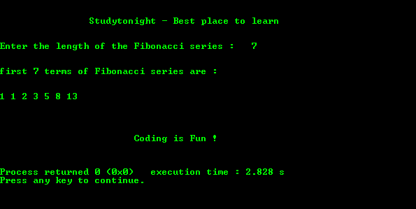

# C 程序：使用递归打印斐波那契数列

> 原文：<https://www.studytonight.com/c/programs/recursion/fibonacci-series-using-recursion>

斐波那契数列被定义为一个数列，其中每个数字是前面两个数字的和，1，1 是数列的前两个元素。

`static`关键字仅用于初始化变量一次。

下面是一个用递归打印斐波那契数列的程序。

```cpp
#include<stdio.h>
// declaring the function
void printFibo(int );

int main()
{
    printf("\n\n\t\tStudytonight - Best place to learn\n\n\n");
    int k, n;
    long int i = 0, j = 1;
    printf("Enter the length of the Fibonacci series: ");
    scanf("%d", &n);
    printf("\n\nfirst %d terms of Fibonacci series are:\n\n\n",n);
    printf("%d ", 1);
    printFibo(n);
    printf("\n\n\t\t\tCoding is Fun !\n\n\n");
    return 0;
}

void printFibo(int aj)
{
    static long int first = 0, second = 1, sum;
    if(aj > 1)
    {
        sum = first + second;
        first = second;
        second = sum;
        printf("%ld ", sum);
        printFibo(aj-1);    // recursive call
    }
    else
    {
        // after the elements, for line break
        printf("\n\n\n");
    }
}
```

### 输出:



* * *

* * *