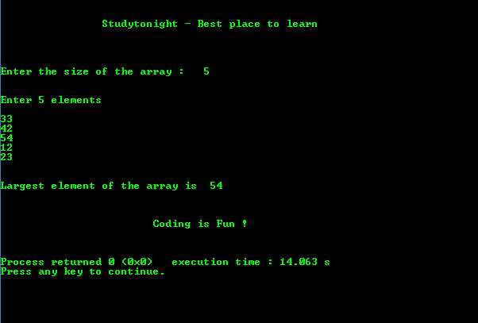

# C 程序：使用递归寻找数组中最大元素

> 原文：<https://www.studytonight.com/c/programs/recursion/largest-array-element-using-recursion>

下面是一个使用递归寻找给定数组中最大数组元素的程序。

`#define`用于初始化一个更像常量的值。

```cpp
#include<stdio.h>

#define MAX 100

int getMaxElement(int []);  // takes array of int as parameter
int size;

int main()
{
    printf("\n\n\t\tStudytonight - Best place to learn\n\n\n");
    int arr[MAX], max, i;
    printf("\n\nEnter the size of the array: ");
    scanf("%d", &size);
    printf("\n\nEnter %d elements\n\n", size);

    for(i = 0; i < size; i++)
    {
        scanf("%d", &arr[i]);
    }

    max = getMaxElement(arr);   // passing the complete array as parameter
    printf("\n\nLargest element of the array is %d\n\n", max);
    printf("\n\n\t\t\tCoding is Fun !\n\n\n");
    return 0;
}

int getMaxElement(int a[])
{
    static int i = 0, max =- 9999;  // static int max=a[0] is invalid
    if(i < size)   // till the last element
    {
        if(max < a[i])
        max = a[i];

        i++;    // to check the next element in the next iteration
        getMaxElement(a);   // recursive call
    }
    return max;
}
```

### 输出:



* * *

* * *