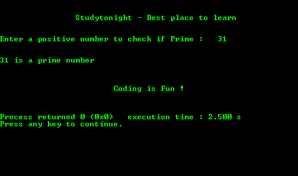

# 用递归求一个数是质数还是合成数的程序

> 原文：<https://www.studytonight.com/c/programs/recursion/prime-or-composite-using-recursion>

*   **素数:**只能被 1 和自身整除的数。
*   **复合数:**不是素数的数。

> ***注:** 1 既不是素数，也不是复合数。*

下面是一个程序，使用递归查找用户输入的数字是质数还是复合数。

```cpp
#include<stdio.h>

// declaring the recursive function
int isPrime(int, int);

int main()
{
    printf("\n\n\t\tStudytonight - Best place to learn\n\n\n");
    int num, prime;
    printf("Enter a positive number to check if Prime: ");
    scanf("%d", &num);
    prime = isPrime(num, num/2);
    if(prime == 1)
    {
        printf("\n\n%d is a prime number\n\n", num);
    }
    else
    {
        printf("\n\n%d is a Composite number\n\n", num);
    }
    printf("\n\n\t\t\tCoding is Fun !\n\n\n");
    return 0;
}

// function definition
int isPrime(int n, int i)
{
    if(i == 1)
        return 1;   // return statement terminates the recursive funtion
    else
    {
        if(n%i == 0)
            return 0;
        else
            isPrime(n, i-1);    // recursive call not using return statement
    }
}
```

### 输出:



* * *

* * *