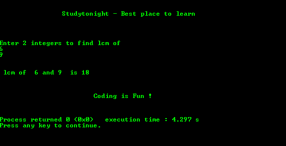

# C 程序：使用递归求两个数的 LCM 

> 原文：<https://www.studytonight.com/c/programs/recursion/lcm-of-two-numbers-using-recursion>

**LCM:** 两个数的最小公倍数是两个数的公倍数。

下面是一个用递归求两个数 LCM 的程序。

```cpp
#include<stdio.h>

int find_lcm(int, int);   // function prototype declaration

int main()
{
    printf("\n\n\t\tStudytonight - Best place to learn\n\n\n");
    int a, b, lcm;
    printf("\n\nEnter 2 integers to find LCM of:\n");
    scanf("%d%d", &a, &b);
    lcm = find_lcm(a,b);    // function call
    printf("\n\n LCM of %d and %d is: %d\n\n", a, b, lcm);
    printf("\n\n\t\t\tCoding is Fun !\n\n\n");
    return 0;
}

int find_lcm(int a, int b)  // function definition
{
    /*
        static variable is initialized only once 
        for each function call
    */
    static int temp = 1;    
    if(temp%a == 0 && temp%b == 0)
    {
        return temp;
    }
    else
    {
        temp++;
        find_lcm(a,b);
        return temp;
    }
}
```

### 输出:



* * *

* * *