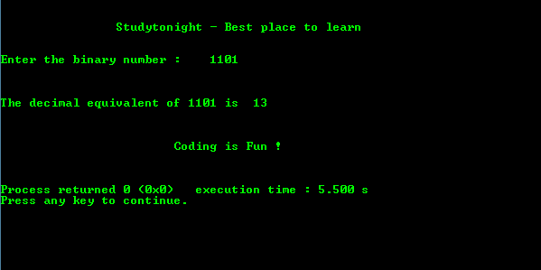
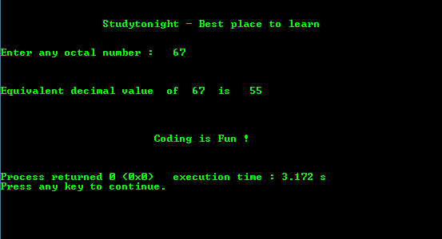
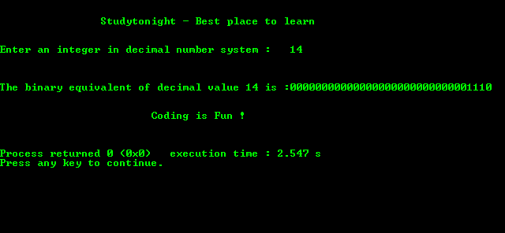
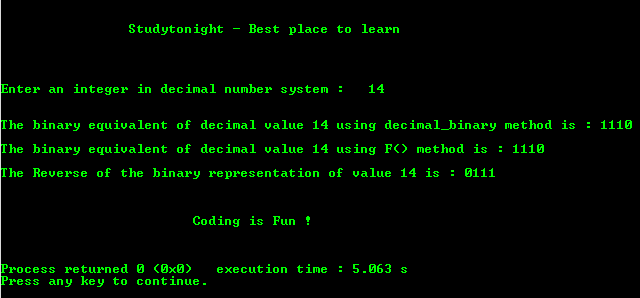

# 展示各种数字系统之间转换的程序

> 原文：<https://www.studytonight.com/c/programs/important-concepts/conversion-between-number-system>

在这里，我们有多个程序来展示各种数字系统之间的转换，如二进制到十进制、八进制到十进制、十进制到二进制，我们甚至会使用**递归**来帮助您理解递归如何在这些程序中使用。让我们开始吧。

* * *

## 将二进制等价转换为十进制等价的程序

下面是一个将二进制数转换成十进制数的程序。

```cpp
#include<stdio.h>
#include<math.h>

// Function prototype declaration
int binary_decimal(int n); 

int main()
{
    printf("\n\n\t\tStudytonight - Best place to learn\n\n\n");
    int n;
    char c;
    printf("Enter the binary number: ");
    scanf("%d", &n);
    printf("\n\n\nThe decimal equivalent of %d is  %d\n\n", n, binary_decimal(n)); // function calling
    printf("\n\n\t\t\tCoding is Fun !\n\n\n");
    return 0;
}

// Definition of the function to convert binary to decimal.
int binary_decimal(int n)
{
    int decimal = 0, i = 0, rem;
    while(n != 0)
    {
        rem = n%10;   // gives the digit at the units place
        n = n/10; // gives the number excluding its units digit
        /*
            pow is a system defined function that takes 
            two integers as input parameters
        */
        decimal += rem*pow(2, i++);
    }
    /*
        return the decimal equivalent of the input 
        binary number to the function call
    */
    return decimal; 
}
```

### 输出:



* * *

## 将八进制转换为十进制的程序

下面是一个将八进制数转换成十进制数的程序。

`%ld`是输入长值的格式说明符。

```cpp
#include<stdio.h>
#include<stdio.h>
#include<math.h>

int main()
{
    printf("\n\n\t\tStudytonight - Best place to learn\n\n\n");
    long int octal, val, decimal = 0;
    int i = 0;
    printf("Enter any octal number: ");
    scanf("%ld", &val);
    octal = val;
    while(octal != 0)
    {
        /*
            i++ is post increment, where value is 
            first assigned and then incremented
        */
      decimal += (octal % 10)*pow(8, i++);
      octal/=10;    // same as octal=octal/10
    }
    printf("\n\n\nEquivalent decimal value of %ld is %ld\n\n\n", val, decimal);
    printf("\n\n\t\t\tCoding is Fun !\n\n\n");
    return 0;
}
```

### 输出:



* * *

## 将十进制等价转换为二进制等价的程序

下面是一个不用递归就能把十进制数转换成二进制数的程序。

```cpp
#include<stdio.h>

int main()
{
    printf("\n\n\t\tStudytonight - Best place to learn\n\n\n");
    int n,c,k;
    printf("Enter an integer in decimal number system: ");
    scanf("%d", &n);

    // In 31 bit format
    printf("\n\n\nThe binary equivalent of decimal value %d is:", n);

    for(c = 31; c >= 0; c--)
    {
        k = n>>c;
        /*
            num&1 = returns true if the last digit of num is 1 
            else false
        */
        if(k&1)
            printf("1");
        else
            printf("0");
    }
    printf("\n");
    printf("\n\n\t\t\tCoding is Fun !\n\n\n");
    return 0;
}
```

### 输出:



* * *

## 用递归将十进制等价转换为二进制等价的程序

下面是一个用递归将十进制数转换成二进制数的程序:

```cpp
#include<stdio.h>

//Function prototype declarations
void decimal_binary(int ); 
void F(int );
void reverse(int );

int main()
{
    printf("\n\n\t\tStudytonight - Best place to learn\n\n\n");
    int n;
    printf("\n\nEnter an integer in decimal number system: ");
    scanf("%d", &n);

    //In 31 bit format
    printf("\n\nThe binary equivalent of decimal value %d using decimal_binary method is: ", n);

    decimal_binary(n);  // function call

    printf("\n\nThe binary equivalent of decimal value %d using F() method is: ", n);
    F(n);   // function call
    printf("\n\nThe Reverse of the binary representation of value %d is: ", n);
    reverse(n); // function call
    printf("\n\n\t\t\tCoding is Fun !\n\n\n");
    return 0;
}

// function definition
void decimal_binary(int i)
{
    if(i <= 1)
    printf("%d", i);   // to print in up to down format
    else
    {
        decimal_binary(i/2);
        printf("%d", i%2);
    }
}

void F(int j)
{
    if(j/2)
    {
        F(j/2);
    }
    printf("%d", j%2);
}

void reverse(int k)
{
    if(k <= 1)
        printf("%d", k);
    else
    {
        printf("%d", k%2);
        F(k/2);
    }
    printf("\n\n");
}
```

### 输出:



* * *

* * *