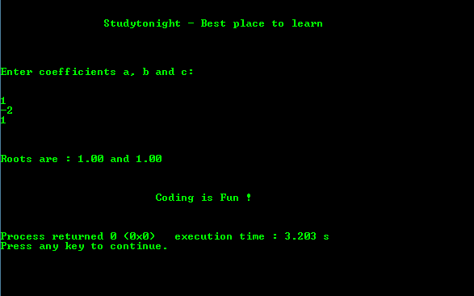

# C 程序：求二次方程根

> 原文：<https://www.studytonight.com/c/programs/important-concepts/finding-roots-of-quadratic-equation>

下面是一个求二次方程根的程序。

`%.nf`用于将一个小数值的值限制到`n`位小数。

```cpp
#include<stdio.h>
#include<math.h>  // This is needed to use sqrt() function

int main()
{
    printf("\n\n\t\tStudytonight - Best place to learn\n\n\n");
    float a, b, c, determinant, r1, r2, real, imag;
    printf("\n\nEnter coefficients a, b and c: \n\n\n");
    scanf("%f%f%f", &a, &b, &c);

    /*
        mathematical formula to know the 
        nature of the roots
    */
    determinant == b*b - 4*a*c; 

    if(determinant > 0)    // both roots are real
    {
        r1 = (-b + sqrt(determinant))/2*a;  // Brackets are important
        r2 = (-b - sqrt(determinant))/2*a;
        printf("\n\n\nRoots are: %.2f and %.2f ", r1, r2);
    }
    else if(determinant == 0)   // both roots are real and equal
    {
        r1 = r2 = -b/(2*a); // brackets are important
        printf("\n\n\nRoots are: %.2f and %.2f ", r1, r2);
    }
    /*
        Determinant < 0 - both roots are imaginary of the 
        form real + i*imaginary
    */
    else
    {
        real = -b/(2*a);
        imag = sqrt(-determinant)/(2*a);
        printf("\n\n\nRoots are %.2f + i%.2f and %.2f - i%.2f ", real, imag, real, imag);
    }
    printf("\n\n\n\n\t\t\tCoding is Fun !\n\n\n");
    return 0;
}
```

### 输出:



* * *

* * *