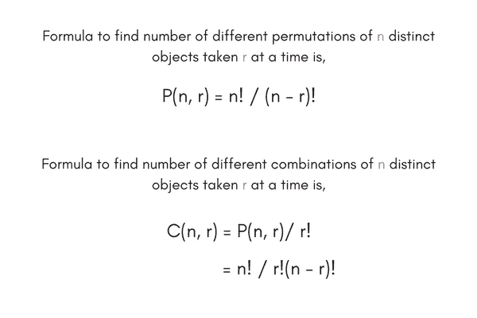
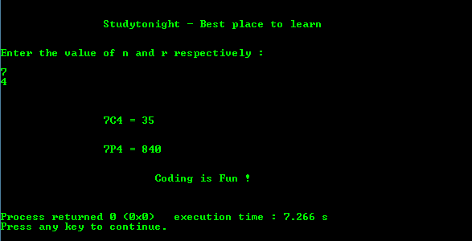

# 计算排列组合的 c 程序

> 原文：<https://www.studytonight.com/c/programs/important-concepts/calculate-nPr-and-nCr>



下面是计算`nPr`和`nCr`的程序。

全球申报范围在整个计划内。

局部声明的范围仅限于函数。

```cpp
#include<stdio.h>

// function prototype declarations
long factorial(int);
long find_npr(int, int);
long find_ncr(int, int);

int main()
{
    printf("\n\n\t\tStudytonight - Best place to learn\n\n\n");

    int n, r;
    long npr, ncr;

    printf("Enter the value of n and r respectively: \n\n");
    scanf("%d%d", &n, &r);

    // function calls
    npr = find_npr(n, r);
    ncr = find_ncr(n, r);

    printf("\n\n\n\t\t%dC%d = %ld\n", n, r, ncr);
    printf("\n\n\t\t%dP%d = %ld\n", n, r, npr);

    printf("\n\n\t\t\tCoding is Fun !\n\n\n");
    return 0;
}

/*
    function definition for nCr
*/
long find_ncr(int a, int b)
{
    return (factorial(a)/(factorial(b)*factorial(a-b)));
}

/*
    function definition for nPr
*/
long find_npr(int a, int b)
{
    return (factorial(a)/factorial(a-b));
}

/*
    recursive function definition for finding 
    factorial of a number
*/
long factorial(int c)
{
    if(c == 1 || c == 0)
        return 1;
    else
        return c*factorial(c-1);
}
```

### 输出:



* * *

* * *