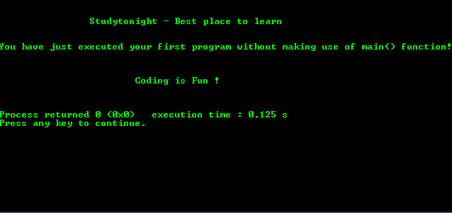

# C 程序：没有主()函数

> 原文：<https://www.studytonight.com/c/programs/misc/program-without-main-function>

下面是一个没有`main()`的程序。

在下面的程序中，`main()`功能在那里，但是使用预处理器隐藏。

第二行可以看到，使用了`#define decode()`函数，保存`m,a,i,n`的字符组合，后面跟`##m##a##i##n`。

这里`##`运算符用于按照使用`##`提到的顺序合并字符，即`main`

在第三行`#define go decode(m,a,i,n)`中，由于我们以相同的顺序指定了字符，`decode`功能将为`go`赋值`main`。

```cpp
#include<stdio.h>
//Need to include the following statements in same manner
#define decode(m,a,i,n) m##a##i##n
#define go decode(m,a,i,n)

int go()
{
    printf("\n\n\t\tStudytonight - Best place to learn\n\n\n");
    printf("You have just executed your first program without making use of main() function!\n");
    printf("\n\n\t\t\tCoding is Fun !\n\n\n");
    return 0;
}
```

### 输出:



我们可以在这里使用不同的单词和组合，比如

```cpp
#define decode(s,t,u,m,p,e,d) m##s##u##t
#define go decode(a,n,i,m,a,t,e)
```

这里按照第一行，第四、第一、第三和第二个字符必须组成一个单词。当同样的组合从**动画**这个词中取出时，它使**成为主**。

* * *

### 使用宏定义 main

```cpp
#include<stdio.h>
#define go main
int go(void)
{
    printf("Welcome to Studytonight");
    return 0;
}
```

这是最简单的技术，我们所做的就是为我们的`main()`函数提供一个不同的名字，这个名字是在程序执行之前设置的`main`。

* * *

### 使用标记粘贴操作符

```cpp
#include<stdio.h>
#define go m##a##i##n
int go(void)
{
    printf("Welcome to Studytonight");
    return 0;
}
```

* * *

* * *