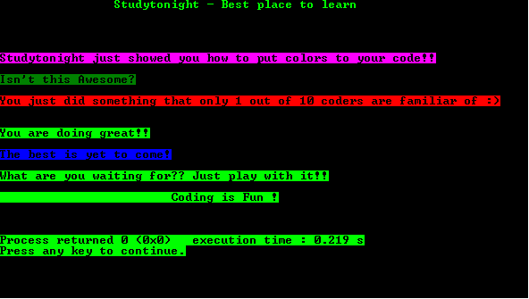

# C 程序：改变文本背景颜色

> 原文：<https://www.studytonight.com/c/programs/misc/changing-text-background-color>

关于该程序的几个要点是:

*   `SetConsoleTextAttribute`:通过**写文件**或**写控制台**功能，或通过**读文件**或**读控制台**功能，设置写入控制台屏幕缓冲区的字符的属性。
*   此函数影响在函数调用后编写的文本。
*   **语法:**

    ```cpp
    BOOL WINAPI SetConsoleTextAttribute(_In_ HANDLE hConsoleOutput , _In_ WORD wAttributes);
    ```

> *更多详细信息，请访问这里的官方文档:[https://docs . Microsoft . com/en-us/windows/console/setconsoletextattribute](https://docs.microsoft.com/en-us/windows/console/setconsoletextattribute)*

下面是改变文本背景颜色的程序。

```cpp
#include<windows.h>
#include<stdio.h>

int main()
{
    printf("\n\n\t\tStudytonight - Best place to learn\n\n\n");

    //BACKGROUND_RED| BACKGROUND_GREEN| BACKGROUND_BLUE| BACKGROUND_INTENSITY
    SetConsoleTextAttribute(GetStdHandle(STD_OUTPUT_HANDLE),BACKGROUND_BLUE|BACKGROUND_RED|BACKGROUND_INTENSITY);
    printf("\n\nStudytonight just showed you how to put colors to your code!!");

    SetConsoleTextAttribute(GetStdHandle(STD_OUTPUT_HANDLE),BACKGROUND_GREEN);
    printf("\n\nIsn't this Awesome?");

    SetConsoleTextAttribute(GetStdHandle(STD_OUTPUT_HANDLE),BACKGROUND_INTENSITY|BACKGROUND_RED);
    printf("\n\nYou just did something that only 1 out of 10 coders are familiar of :)\n");

    SetConsoleTextAttribute(GetStdHandle(STD_OUTPUT_HANDLE),BACKGROUND_GREEN|BACKGROUND_INTENSITY);
    printf("\n\nYou are doing great!!");

    SetConsoleTextAttribute(GetStdHandle(STD_OUTPUT_HANDLE),BACKGROUND_BLUE|BACKGROUND_INTENSITY);
    printf("\n\nThe best is yet to come!");

    SetConsoleTextAttribute(GetStdHandle(STD_OUTPUT_HANDLE),BACKGROUND_GREEN|BACKGROUND_INTENSITY);
    printf("\n\nWhat are you waiting for?? Just play with it!!");

    printf("\n\n\t\t\tCoding is Fun !\n\n\n");
    return 0;
}
```

### 输出:



* * *

* * *