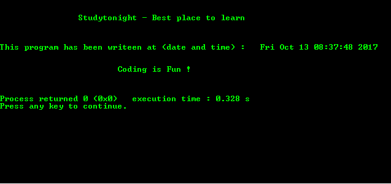

# C 程序：显示当前日期和时间

> 原文：<https://www.studytonight.com/c/programs/misc/display-current-date-and-time>

C 库函数`char *ctime(const time_t *timer)`根据参数**定时器**返回一个代表本地时间的字符串。返回的字符串具有以下格式: **Www Mmm dd hh:mm:ss yyyy** 。这里 **Www** 是工作日， **Mmm** 是字母中的月份， **dd** 是月份中的日子， **hh:mm:ss** 是时间， **yyyy** 是年份。

下面是显示当前日期和时间的程序。

`#include<time.h>`用于`time`和`ctime`功能以及`time_t`数据类型。

```cpp
#include<stdio.h>
#include<time.h>

int main()
{
    printf("\n\n\t\tStudytonight - Best place to learn\n\n\n");

    time_t t;   // not a primitive datatype
    time(&t);

    printf("\nThis program has been writeen at (date and time): %s", ctime(&t));

    printf("\n\n\t\t\tCoding is Fun !\n\n\n");
    return 0;
}
```

### 输出:



* * *

* * *