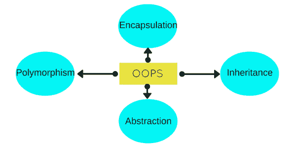

# C++ 中的面向对象编程

> 原文：<https://www.studytonight.com/cpp/cpp-and-oops-concepts.php>

面向对象编程是一种与类、对象和围绕这两个概念的各种其他概念相关联的编程风格，如[继承](overview-of-inheritance.php)、[多态](function-overriding.php)、抽象、封装等。

在下面的视频中，我们借助一个非常容易理解的例子解释了面向对象编程的基本概念。如果你想跳过视频，所有内容都在下面讨论。

让我们试着通过一个简单的例子来了解一下这些。人类是有生命的形式，大致分为两种，男性和女性。正确是真的。每个人(男性或女性)都有两条腿、两只手、两只眼睛、一个鼻子、一颗心等。男性和女性都有一些常见的身体部位，但男性有一些女性没有的特定身体部位，女性有一些身体部位，但男性没有。

所有的人都走路、吃饭、看、说话、听等等。现在，男性和女性都执行一些共同的功能，但是两者都有一些细节，这对另一个是无效的。比如:女的可以生，男的不可以生，所以这只针对女的。

人体解剖学很有趣，不是吗？但是让我们看看这一切是如何与 C++ 和 OOPS 相关联的。在这里，我们将尝试通过这个例子来解释所有的 OOPS 概念，稍后我们将有所有这些的技术定义。

* * *

### 班级

这里我们可以把**人类**作为一个类。类是定义其属性和功能的任何功能实体的蓝图。像人一样，有身体的一部分，做各种动作。

* * *

### 遗产

考虑`HumanBeing`一个类，有手、腿、眼等属性，有走、说、吃、看等功能。`Male`和`Female`也是类，但是大部分属性和函数都包含在`HumanBeing`中，因此它们可以使用**继承**的概念从类`HumanBeing`继承一切。

* * *

### 目标

我的名字是阿布舍克，我是类`Male`的**实例/对象**。当我们说，人类，男性或女性，我们只是指一种，你，你的朋友，我，我们是这些类的形式。我们有一个物理存在，而一个类只是一个逻辑定义。我们是目标。

* * *

### 抽象

抽象意味着，只向外界展示需要的东西，而隐藏细节。继续我们的例子，**人类的**会说话，会走路，会听，会吃，但是细节对外界是隐藏的。在我们的案例中，我们可以将皮肤作为抽象因素，隐藏内部机制。

* * *

### 包装

这个概念用我们的例子来解释有点棘手。我们的腿被绑在一起帮助我们走路。我们的手，帮我们拿东西。属性与函数的这种绑定称为封装。

* * *

### 多态

多态是一个概念，它允许我们重新定义某件事的工作方式，要么通过改变它是如何完成的，要么通过改变它所使用的部分。这两种方式都有不同的术语。

如果我们用手走路，而不是用腿走路，这里我们将改变用来做某事的部分。因此这被称为过载。

如果有一个明确的行走方式，但我希望以不同的方式行走，但使用我的腿，像其他人一样。然后我就可以随心所欲的走路了，这就叫做**压倒**。

* * *

## 糟糕的概念定义

现在，让我们讨论一下面向对象编程的一些主要特性，您将在 C++ 中使用这些特性(技术上)。

1.  目标
2.  班级
3.  抽象
4.  包装
5.  [继承](overview-of-inheritance.php)
6.  过载
7.  [异常处理](exception-handling-in-cpp.php)

* * *

### 目标

对象是面向对象程序设计的基本单元。它们是类的实例，具有数据成员并使用各种成员函数来执行任务。

* * *

### 班级

它类似于 C 语言中的结构。类也可以定义为用户定义的数据类型，但它也包含函数。所以，类基本上是对象的蓝图。它声明并定义了对象将拥有哪些数据变量，以及可以对类的对象执行哪些操作。

* * *

### 抽象

抽象是指只显示应用程序的基本特征，隐藏细节。在 C++ 中，类可以向外部世界提供访问和使用数据变量的方法，避免直接访问变量，或者类甚至可以声明每个人都可以访问的所有内容，或者可能只是继承它的类。这可以使用访问说明符来完成。

* * *

### 包装

也可以说是数据绑定。封装就是在类中将数据变量和函数绑定在一起。

* * *

### 遗产

继承是一种反复重用曾经编写的代码的方式。继承的类称为**基**类&继承的类称为**派生**类。它们也被称为父类和子类。

因此，当派生类继承基类时，派生类可以使用基类中定义的所有函数，从而使代码可重用。

* * *

### 多态

这是一个特性，它允许我们创建具有相同名称但不同参数的函数，这些函数将执行不同的操作。也就是说，功能名称相同，但功能方式不同。或者，它还允许我们重新定义一个函数，为它提供一个全新的定义。在接下来的课程中，您将很快详细了解如何做到这一点。

* * *

### 异常处理

异常处理是 OOP 的一个特性，用于处理运行时产生的未解决的异常或错误。

* * *

* * *