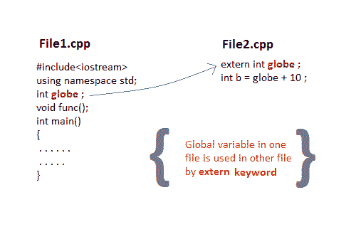

# C++中的存储类

> 原文：<https://www.studytonight.com/cpp/storage-classes-in-cpp>

存储类用于指定变量的生存期和范围。如何为变量分配存储以及编译器如何处理变量取决于这些存储类。

这些基本上分为 5 种不同的类型:

1.  全局变量
2.  局部变量
3.  寄存器变量
4.  静态变量
5.  外部变量

* * *

## 全局变量

这些在开始时、在所有功能体之前定义，并且在整个程序中可用。

```cpp
using namespace std;
int globe;      // Global variable
void func();
int main()
{
    .....
} 
```

* * *

## 局部变量

它们是在特定范围内定义和可用的。它们也被称为**自动变量**，因为它们在进入范围时产生，在范围结束时自动消失。

使用关键字 **auto** ，但是默认情况下所有局部变量都是 auto，所以我们不必在变量去重之前显式添加关键字 auto。该变量的默认值为**垃圾**。

* * *

## 寄存器变量

这也是一种局部变量。这个关键字用来告诉编译器尽可能快地访问这个变量。变量存储在寄存器中，以提高访问速度。

但是您永远不能使用或计算寄存器变量的**地址，并且寄存器变量只能在**块**内声明，这意味着您不能有*全局*或*静态寄存器变量*。**

* * *

## 静态变量

静态变量是在程序执行开始时只被初始化和分配存储一次的变量，无论它们在程序中被使用和调用多少次。静态变量保持其值直到程序结束。

```cpp
void fun()
{
    static int i = 10;
    i++;
    cout << i;
}
int main()
{
    fun();      // Output = 11
    fun();      // Output = 12
    fun();      // Output = 13
}
```

由于`i`是静态的，因此它将通过函数调用保持其值，并且在开始时只初始化一次。

静态说明符也在类中使用，但是我们将在后面学习。

* * *

## 外部变量

此关键字用于访问某个文件中的[变量](variables-scope-details.php)，该文件被声明为在其他文件中定义的&，也就是说，在一个文件中全局变量的存在是使用 extern 关键字在另一个文件中声明的。



* * *

* * *