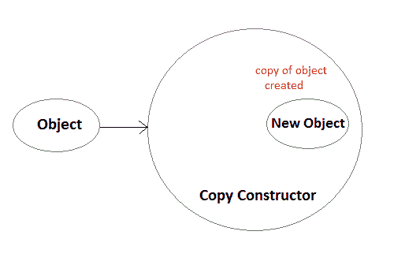
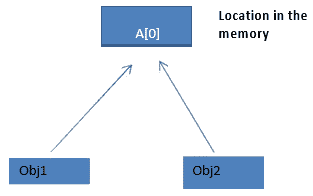
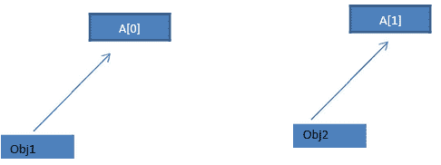

# C++ 中的复制构造器

> 原文：<https://www.studytonight.com/cpp/copy-constructor-in-cpp.php>

复制[构造器](constructors-and-destructors-in-cpp.php)是一种构造器，用于创建一个类类型的已有对象的副本。通常是 **X (X & )** 的形式，其中 X 是类名。编译器为所有类提供默认的复制构造器。

* * *

## 复制构造器的语法

```cpp
Classname(const classname & objectname)
{
    . . . .
}
```

由于它用于创建对象，因此被称为构造器。并且，它创建了一个新的对象，它是现有副本的精确副本，因此它被称为**副本构造器**。



以下是复制构造器的示例程序:

```cpp
#include<iostream>
using namespace std;
class Samplecopyconstructor
{
    private:
    int x, y;   //data members

    public:
    Samplecopyconstructor(int x1, int y1)
    {
        x = x1;
        y = y1;
    }

    /* Copy constructor */
    Samplecopyconstructor (const Samplecopyconstructor &sam)
    {
        x = sam.x;
        y = sam.y;
    }

    void display()
    {
        cout<<x<<" "<<y<<endl;
    }
};
/* main function */
int main()
{
    Samplecopyconstructor obj1(10, 15);     // Normal constructor
    Samplecopyconstructor obj2 = obj1;      // Copy constructor
    cout<<"Normal constructor : ";
    obj1.display();
    cout<<"Copy constructor : ";
    obj2.display();
    return 0;
}
```

普通构造器:10 15 复制构造器:10 15

* * *

## 浅复制构造器

通过实例说明了浅拷贝构造器的概念。两名学生正在通过网络共享的两台不同机器上同时在 excel 工作表中输入他们的详细信息。他们两人所做的更改将反映在 excel 工作表中。因为在两个位置都打开了同一个 excel 工作表。这就是浅拷贝构造器的情况。两个对象将指向相同的内存位置。

浅复制复制对原始对象的引用。编译器提供默认的复制构造器。默认复制构造器提供了一个浅复制，如下例所示。它是一个对象的逐位复制。

当类不处理任何动态分配的内存时，使用浅复制构造器。



在下面的例子中，你可以看到两个对象，c1 和 c2，指向同一个内存位置。当调用`c1.concatenate()`函数时，也会影响 c2。因此`c1.display()`和`c2.display()`将给出相同的输出。

```cpp
#include<iostream>
#include<cstring>
using namespace std;
class CopyConstructor
{
    char *s_copy;
    public:
    CopyConstructor(const char *str)
    {
        s_copy = new char[16]; //Dynamic memory allocation
        strcpy(s_copy, str);
    }
    /* concatenate method */
    void concatenate(const char *str)
    {
        strcat(s_copy, str); //Concatenating two strings
    }
    /* copy constructor */
    ~CopyConstructor ()
    { 
        delete [] s_copy;
    }
    void display()
    {
        cout<<s_copy<<endl;
    }
};
/* main function */
int main()
{
    CopyConstructor c1("Copy");
    CopyConstructor c2 = c1; //Copy constructor
    c1.display();
    c2.display();
    c1.concatenate("Constructor");    //c1 is invoking concatenate()
    c1.display();
    c2.display();
    return 0;
}
```

复制复制构造器复制构造器

* * *

## 深度复制构造器

让我们考虑一个解释深度复制构造器的例子。你应该明天提交一份作业，但你的时间不多了，所以你从你的朋友那里抄来的。现在你和你的朋友有相同的作业内容，但是不同的副本。因此，在你的作业副本中所做的任何修改都不会反映在你朋友的副本中。这就是深度复制构造器中发生的情况。

深度复制为复制的信息分配单独的内存。所以来源和复制是不同的。在一个内存位置进行的任何更改都不会影响在另一个位置的复制。当我们使用指针分配动态内存时，我们需要用户定义的复制构造器。两个对象将指向不同的内存位置。



深度复制的一般要求:

*   普通的构造器。
*   删除动态分配的内存的析构器。
*   复制构造器，用于复制动态分配的内存。
*   重载赋值运算符。

在前面的例子中，你可以看到当 c1 调用`concatenate()`时，c1 和 c2 都会发生变化，因为两者都指向同一个内存位置。

在下面的示例中，您可以看到用户定义的复制构造器，即深度复制构造器。这里 c1 和 c2 都指向不同的存储位置。因此，在一个位置进行的更改不会影响另一个位置。

```cpp
#include<iostream>
#include<cstring>
using namespace std;
class CopyConstructor
{
    char *s_copy;
    public:
    CopyConstructor (const char *str)
    {
        s_copy = new char[16];  //Dynamic memory alocation
        strcpy(s_copy, str);
    }

    CopyConstructor (const CopyConstructor &str)
    {
        s_copy = new char[16]; //Dynamic memory alocation
        strcpy(s_copy, str.s_copy);
    }

    void concatenate(const char *str)
    {
        strcat(s_copy, str); //Concatenating two strings
    }

    ~CopyConstructor()
    { 
        delete [] s_copy;
    }

    void display()
    {
        cout<<s_copy<<endl;
    }
};
/* main function */
int main()
{
    CopyConstructor c1("Copy");
    CopyConstructor c2 = c1;    //copy constructor
    c1.display();
    c2.display();
    c1.concatenate("Constructor");    //c1 is invoking concatenate()
    c1.display();
    c2.display();
    return 0;
}
```

复制复制构造器复制

* * *

* * *