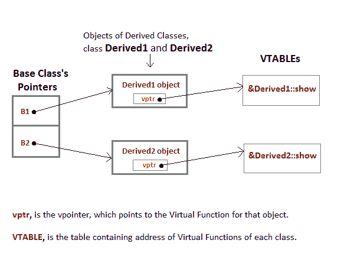

# C++ 中的虚函数

> 原文：<https://www.studytonight.com/cpp/virtual-functions.php>

虚函数是基类中的一个函数，在派生类中被重写，它告诉编译器对这个函数执行**后期绑定**。

`Virtual`关键字用于使基类的成员函数虚拟化。

* * *

## C++ 中的后期绑定

在后期绑定中，函数调用在运行时被解析。因此，现在编译器在运行时确定对象的类型，然后绑定函数调用。后期绑定也称为**动态**绑定或**运行时**绑定。

* * *

### 没有虚拟关键字的问题

让我们试着了解一下`virtual`关键字修复的问题是什么，

```cpp
class Base
{
    public:
    void show()
    {
        cout << "Base class";
    }
};

class Derived:public Base
{
    public:
    void show()
    {
        cout << "Derived Class";
    }
}

int main()
{
    Base* b;       //Base class pointer
    Derived d;     //Derived class object
    b = &d;
    b->show();     //Early Binding Ocuurs
} 
```

基类

当我们使用基类的指针来保存派生类的对象时，基类指针或引用将总是调用函数的基版本

* * *

## 在 C++ 中使用虚拟关键字

我们可以在声明基类的方法时使用 **virtual** 关键字使它们虚拟化。虚拟关键字将导致该方法的后期绑定。

```cpp
class Base
{
    public:
    virtual void show()
    {
        cout << "Base class\n";
    }
};

class Derived:public Base
{
    public:
    void show()
    {
        cout << "Derived Class";
    }
}

int main()
{
    Base* b;       //Base class pointer
    Derived d;     //Derived class object
    b = &d;
    b->show();     //Late Binding Ocuurs
} 
```

衍生类别

在基类的函数中使用 Virtual 关键字时，会发生后期绑定，并且会调用函数的派生版本，因为基类指针指向派生类对象。

* * *

### 使用虚拟关键字和访问派生类的私有方法

我们可以借助 virtual 关键字，从基类指针调用派生类的 **private** 函数。编译器仅在编译时检查访问说明符。所以在运行时，当后期绑定发生时，它不会检查我们是在调用私有函数还是公共函数。

```cpp
#include <iostream>
using namespace std;

class A
{
    public:
    virtual void show()
    {
        cout << "Base class\n";
    }
};

class B: public A
{
    private:
    virtual void show()
    {
        cout << "Derived class\n";
    }
};

int main()
{
    A *a;
    B b;
    a = &b;
    a->show(); 
} 
```

衍生类别

* * *

## C++ 中后期绑定的机制



为了完成后期绑定，编译器为每个具有虚函数的类创建**虚拟表**。虚函数的地址被插入到这些表中。每当创建这样一个类的对象时，编译器都会秘密地插入一个名为**的指针**，指向该对象的 VTABLE。因此，当调用函数时，编译器能够通过使用 vpointer 绑定正确的函数来响应调用。

* * *

### 需要记住的要点

1.  只有基类方法的声明需要**虚拟**关键字，而不是定义。
2.  如果一个函数在基类中被声明为**虚化**，那么它在它的所有派生类中将是虚化的。
3.  虚拟功能的地址放在 **VTABLE** 中，复印机使用 **VPTR** (虚拟指针)指向虚拟功能。

* * *

* * *