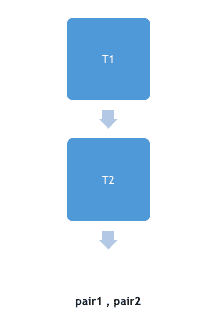

# STL 中的模板对

> 原文:[https://www.studytonight.com/cpp/stl/stl-pair-template](https://www.studytonight.com/cpp/stl/stl-pair-template)

**注意**:虽然 Pair 和 Tuple 实际上不是容器库的一部分，但是我们仍然会讨论它们，因为它们是编程竞赛中非常常见的需求，并且它们使得某些事情非常容易实现。

对的语法是:

```cpp
pair<T1,T2>  pair1, pair2 ;
```

上面的代码创建了两对，即第一对 1 和第二对 2，它们都有第一个 T1 类型的对象和第二个 T2 类型的对象。

现在 T1 将被称为第一个，T2 将被称为配对 1 和配对 2 的第二个成员。



* * *

## 配对模板:一些常用函数

以下是配对模板一些功能:

*   运算符`=`:给一对赋值。
*   交换:交换配对的内容。
*   make_pair():创建并返回一个包含由参数列表定义的对象的对。
*   运算符(==，！=，>，< , <= , > =):按字典顺序比较两对。

* * *

## 演示结对模板的程序

```cpp
#include <iostream>

using namespace std;    

int main ()
{
   pair<int,int> pair1, pair3;    //creats pair of integers
   pair<int,string> pair2;    // creates pair of an integer an a string

   pair1 = make_pair(1, 2);     // insert 1 and 2 to the pair1
   pair2 = make_pair(1, "Studytonight") // insert 1 and "Studytonight" in pair2
   pair3 = make_pair(2, 4)
   cout<< pair1.first << endl;  // prints 1, 1 being 1st element of pair1
   cout<< pair2.second << endl; // prints Studytonight

   if(pair1 == pair3)
        cout<< "Pairs are equal" << endl;
   else
        cout<< "Pairs are not equal" << endl;

   return 0;
} 
```

* * *

* * *