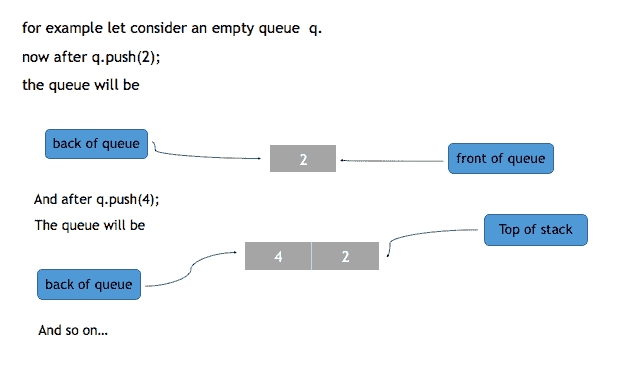

# STL 中的队列容器

> 原文：<https://www.studytonight.com/cpp/stl/stl-container-queue>

队列容器用于在 C++ 中复制队列，插入总是在队列的后面进行，删除总是在队列的前面进行。

以下是定义队列的语法:

```cpp
**queue**< object_type >  *queue_name;*
```

上面的语句将创建一个名为 queue_name 的队列，类型为 object_type。

* * *

## 队列容器的成员函数

以下是 STL 中队列容器的一些常用函数:

### `push`功能

`push()`用于将元素插入队列。元素被插入到队列的后面。



```cpp
#include <iostream>      
#include <queue> 

using namespace std;   

int main ()
{
    queue <int> q;   *// creates an empty queue of integer q* 

    q.**push>**(2);   *// pushes 2 in the queue  , now front = back = 2*
    q.**push**(3);   *// pushes 3 in the queue  , now front = 2 , and back = 3*
}
```

### `pop`功能

此方法从队列的前面移除单个元素，因此将其大小减少 1。移除的元素是首先输入的元素。`pop()`不返回任何内容。


```cpp
#include <iostream>      
#include <queue> 

using namespace std;   

int main ()
{
    queue <int> q;   *// creates an empty queue of integer q* 

    q.**push>**(2);   *// pushes 2 in the queue  , now front = back = 2*
    q.**push**(3);   *// pushes 3 in the queue  , now front = 2 , and back = 3*

    q.**pop**() ;  // removes 2 from the stack , front = 3
}
```

### `front` `and back`功能

`front()`返回队列的前面元素，而`back()`返回队列的后面元素。请注意，两者都返回元素，而不是删除它，这与 **pop()** 不同。

### `size`和`empty`功能

`size()`返回队列中存在的元素数量，而`empty()`检查队列是否为空。如果队列为空，则 empty 返回 true，否则返回 false。

### `Swap`功能

方法`swap()`交换两个队列的元素。

* * *

* * *