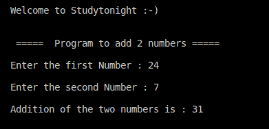

# C++ 程序：二元加法

> 原文：<https://www.studytonight.com/cpp-programs/cpp-adding-two-numbers-program>

大家好！

在本教程中，我们将学习如何用 C++ 编程语言编写一个基本程序来**加上两个数字**。

**代号:**

```cpp
#include<iostream>

using namespace std;

int main()
{
    //variable declaration
    int a, b;

    //variable declaration and initialization  
    int sum=0;

    //take user input
    cout << "\n\nWelcome to Studytonight :-)\n\n\n";
    cout << " =====  Program to add 2 numbers ===== \n\n";

    cout << "Enter the first Number : ";
    cin >> a;

    cout << "\nEnter the second Number : ";
    cin >> b;

    //Adding the two numbers
    sum = a + b;

    //displaying the final output (sum)
    cout << "\nAddition of the two numbers is : " << sum;

    return 0;
}
```

**输出:**



## 用 C++ 添加 2 个数字的程序解释道:

**1。** `**int sum=0;**`

变量可以在声明时初始化。这通常是为了确保将来要使用的值最初没有设置为某个随机值。

**2。`sum = a + b;`**

所有基本的数学运算，如:

1.  **加法`(+)`T2】**

2.  **减法`(-)`T2】**

3.  **乘**

4.  **师`(/)`T2】**

5.  **余数或模数`(%)`** 等。

可以在 C++ 中的两个数字之间(一次)执行，类似于任何其他编程语言。

我们会推荐你**自己修改程序并测试以上所有操作**，培养更好的理解。

***保持学习:***

* * *

* * *