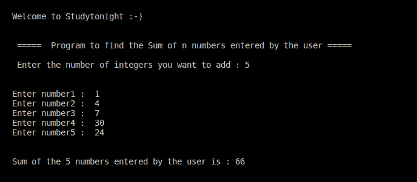

# C++ 程序：计算用户输入的`n`个数之和

> 原文：<https://www.studytonight.com/cpp-programs/cpp-find-sum-of-n-numbers-entered-by-the-user>

大家好！

在本教程中，我们将学习如何用 C++ 编程语言**对用户输入的 n 个数字**求和。

**代号:**

```cpp
#include <iostream>
using namespace std;

int main()
{
    cout << "\n\nWelcome to Studytonight :-)\n\n\n";
    cout << " =====  Program to find the Sum of n numbers entered by the user ===== \n\n";

    //variable declaration
    int n,i,temp;

    //As we are dealing with the sum, so initializing with 0.
    int sum = 0;

    //taking input from the command line (user)
    cout << " Enter the number of integers you want to add : ";
    cin >> n;
    cout << "\n\n";

    //taking n numbers as input from the user and adding them to find the final sum
    for(i=0;i<n;i++)
    {
        cout << "Enter number" << i+1 << " :  ";
        cin >> temp;
        //add each number to the sum of all the previous numbers to find the final sum
        sum += temp;
    }

    cout << "\n\nSum of the " << n << " numbers entered by the user is : "<< sum << endl;
    cout << "\n\n\n";

    return 0;
}
```

**输出:**



现在让我们看看我们在上面的程序中做了什么。

## 程序解释:

为了更好地理解，让我们分解代码的各个部分。

```cpp
//taking n numbers as input from the user and adding them to find the final sum
for(i=0; i<n ;i++)
{
    cout << "Enter number" << i+1 << " :  ";
    cin >> temp;

    //add each number to the sum of all the previous numbers to find the final sum
    sum += temp;
}
```

从这段代码中学到的一件事是，**当我们不必使用用户输入的单个元素时，没有必要创建和数组或任何这样的数据结构来存储它们，因为这只会导致空间浪费。**

例如，在上面的代码中，由于我们需要找到所有数字的总和，我们将用户输入的每个数字放入同一个变量中，并将其添加到`sum`变量中，然后再次对下一个数字使用同一个变量，以此类推。

**继续学习:**

* * *

* * *