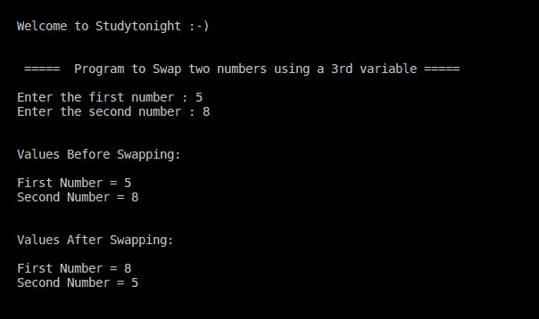

> 原文:[https://www . study south . com/CPP-programs/CPP-swap-两个数字-使用第三个变量](https://www.studytonight.com/cpp-programs/cpp-swap-two-numbers-using-a-3rd-variable)

# C++用第三个变量交换两个数字

大家好！

在本教程中，我们将学习如何在 C++编程语言中使用第三个变量交换两个数字。

<u>**代号:**</u>

```cpp
#include <iostream>
using namespace std;

int main()
{
    cout << "\n\nWelcome to Studytonight :-)\n\n\n";
    cout << " =====  Program to Swap two numbers using a 3rd variable ===== \n\n";

    //variable declaration
    int a,b,temp;

    //taking input from the command line (user)
    cout << "Enter the first number : ";
    cin >> a;

    cout << "Enter the second number : ";
    cin >> b;

    cout<<"\n\nValues Before Swapping:  \n"<<endl;
    cout<<"First Number = " << a <<endl;
    cout<<"Second Number = " << b <<endl;

    //Logic for swapping the two numbers using an extra variable 'temp'
    temp = a;
    a = b;
    b = temp;

    cout << "\n\nValues After Swapping:  \n"<<endl;
    cout << "First Number = " << a <<endl;
    cout << "Second Number = " << b <<endl;
    cout << "\n\n\n";

    return 0;
} 
```

<u>**输出:**</u>



现在让我们看看我们在上面的程序中做了什么。

## 程序解释:

为了更好地理解，让我们分解代码的各个部分。

```cpp
//Logic for swapping the two numbers using an extra variable 'temp'
temp = a;
a = b;
b = temp;
```

这里涉及的逻辑是，与其他编程语言类似，C++中的**变量存储最近存储到其中的值。**

因此，首先我们将`a`的值放入一个新的变量`temp`中，这样一旦`b`的值被赋值给`a`，那么`a`的原始值就不会丢失。

然后我们利用`temp`，将`a`的原值赋给`b`。

***保持学习:***

* * *

* * *