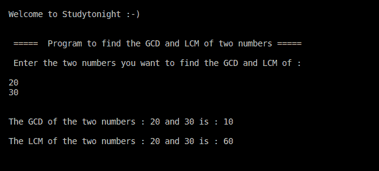

# C++ 程序查找 GCD 和 LCM

> 原文：<https://www.studytonight.com/cpp-programs/cpp-program-to-find-gcd-and-lcm>

大家好！

在本教程中，我们将学习如何用 C++ 编程语言**找到给定的两个数字**的 GCD 和 LCM。

因此，让我们首先了解这里涉及的术语。

### 什么是 GCD？

**两个数字的最大公约数或 GCD** 是将两个数字完美相除的**最大可能数**(余数 0)。

<u>**例:**</u>

考虑两个数字是 2 和 3。现在 12 同时以 2 和 3 为因子，但是 6 是同时以 2 和 3 为因子的最小可能数，或者 **6 是 2 和 3 的最小倍数**。因此 6 是 2 和 3 的 LCM。

### 什么是 LCM？

两个数字的最小公倍数或 **LCM** 是两个数字的倍数或以两个数字为因子的**最小可能数。**

<u>**例:**</u>

考虑两个数字是 20 和 30。现在 1 完美地将 20 和 30 分开。即使是 2 和 5 也能完美地将 20 和 30 分开。但是 **10 是将 20 和 30 除在一起的最大数字**，因此被认为是 20 和 30 的 GCD。

<u>**代号:**</u>

```cpp
#include <iostream>
using namespace std;

int main()
{
    cout << "\n\nWelcome to Studytonight :-)\n\n\n";
    cout << " =====  Program to find the GCD and LCM of two numbers ===== \n\n";

    //variable declaration
    int n1, n2, i;

    //variable declaration and initialization
    int gcd = 1, lcm = 1;  

    //taking input from the command line (user)
    cout << " Enter the two numbers you want to find the GCD and LCM of : \n\n";
    cin >> n1 >> n2;

    //logic to calculate the GCD and LCM of the two numbers
    for ( i = 1; i < 1000; i++)
    {
        //i is the least value that perfectly divides both the numbers and hence the GCD
        if ((n1 % i == 0) && (n2 % i == 0))
        {
            gcd = i;          
        }
    }

    lcm = (n1 * n2) / gcd;

    cout << " \n\nThe GCD of the two numbers : " << n1 << " and " << n2 << " is : " << gcd;
    cout << " \n\nThe LCM of the two numbers : " << n1 << " and " << n2 << " is : " << lcm << "\n\n";
    cout << "\n\n\n";

    return 0;
}
```

<u>**输出:**</u>



**继续学习:**

* * *

* * *