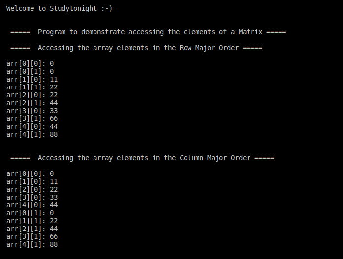

> 原文:[https://www . study south . com/CPP-programs/CPP-program-to-access-a-matrix-2d-array 的元素](https://www.studytonight.com/cpp-programs/cpp-program-to-access-the-elements-of-a-matrix-2d-array)

# 访问矩阵元素(2D 数组)的 C++程序

大家好！

在本教程中，我们将学习如何用 C++编程语言**访问矩阵(2D 数组)**的元素。

在编程中，矩阵只不过是一个 2D 阵列。这两个维度被称为**行**和**列**。

有两种方法可以访问矩阵的元素:

1.  **行主顺序(RMO):** 这是访问 2D 数组元素的默认和标准方式。**这里我们按行访问元素，即我们首先访问第一行的所有元素，然后只移动到第二行，同样从第一列开始。**重复这个过程，直到我们到达矩阵的末尾，即最后一行最后一列的元素。为了更好地理解，请参考下面的代码。

2.  **列主顺序(CMO):** 这是访问 2D 数组元素的另一种方式。**这里我们按列访问元素，即我们首先访问第一列的所有元素，然后只移动到第二列，同样从第一行开始。**重复这个过程，直到我们到达矩阵的末尾，即最后一列最后一行的元素。为了更好地理解，请参考下面的代码。

<u>**代号:**</u>

```cpp
#include <iostream>
using namespace std;

int main()
{
    cout << "\n\nWelcome to Studytonight :-)\n\n\n";
    cout << " =====  Program to demonstrate accessing the elements of a Matrix ===== \n\n";

    //loop variable r to iterate rows and c to iterate columns.
    int r, c;

    //declaring and initializing the 2D array.
    int arr[5][2] = {{0, 0},
                   {11, 22},
                   {22, 44},
                   {33, 66},
                   {44, 88}};   

    cout << " =====  Accessing the array elements in the Row Major Order ===== \n\n";    
    // outputing the value of each of the array element
    for (r = 0; r < 5; r++)
    {
        for (c = 0; c < 2; c++)
        {
            cout << "arr[" << r << "][" << c << "]: ";
            cout << arr[r][c] << endl;
        }
    }

    cout << "\n\n";

    cout << " =====  Accessing the array elements in the Column Major Order ===== \n\n";    
    // outputing the value of each of the array element
    for (c = 0; c < 2; c++)
    {
        for (r = 0; r < 5; r++)
        {
            cout << "arr[" << r << "][" << c << "]: ";
            cout << arr[r][c] << endl;
        }
    }

    cout << "\n\n";

    return 0;
}
```

<u>**输出:**</u>



我们希望这篇文章能帮助你更好地理解访问 2D 数组元素的不同方法。如有任何疑问，请随时通过下面的评论区联系我们。

**继续学习:**

* * *

* * *