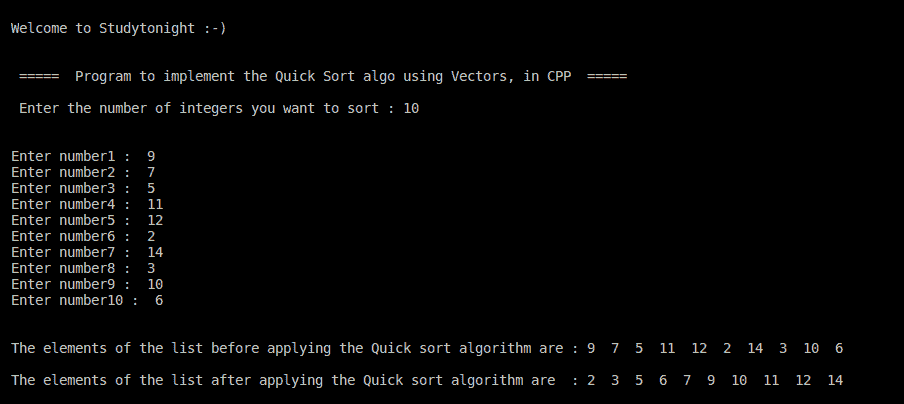

> 原文:[https://www . study south . com/CPP-programs/CPP-program-for-quick-sort](https://www.studytonight.com/cpp-programs/cpp-program-for-quick-sort)

# 快速排序的 C++程序

大家好！

在本教程中，我们将学习如何用 C++编程语言实现**快速排序算法**。

为了从头开始理解**快速排序算法**，我们强烈建议您首先访问我们的教程，因为我们已经介绍了它的逐步实现，这里:[https://www.studytonight.com/data-structures/quick-sort](https://www.studytonight.com/data-structures/quick-sort)

<u>**代号:**</u>

```cpp
#include <iostream>

#include<vector>

using namespace std;

//Separate method to print the list provided by the calling method
void printElems(vector < int > list) {
    int i;
    int len = list.size();
    for (i = 0; i < len; i++)
        cout << list[i] << "  ";

}

//This function returns the index of the element (pivot) that has been moved to its final position 
int partition_algo(vector < int > & list, int beg, int end) {
    int p = beg, pivot = list[beg], loc;

    //For all the elements following the pivot element
    for (loc = beg + 1; loc <= end; loc++) {
        if (pivot > list[loc]) {
            list[p] = list[loc];
            list[loc] = list[p + 1];
            list[p + 1] = pivot;

            p++;
        }
    }

    return p; //p is the index of the pivot element
}

//The Quick sort logic- making modifications to the actual list itself
void quickSort(vector < int > & list, int beg, int end) {
    if (beg < end) {
        //p stores the index of the pivot element after it gets sorted
        int p = partition_algo(list, beg, end);

        //Applying Quicksort on the elements on Left of the pivot element
        quickSort(list, beg, p - 1);

        //Applying Quicksort on the elements on Right of the pivot element
        quickSort(list, p + 1, end);
    }
}

int main() {
    int i, num, n;

    //Declaring the Vector to store the integer elements to be sorted
    vector < int > v;

    cout << "\n\nWelcome to Studytonight :-)\n\n\n";
    cout << " =====  Program to implement the Quick Sort algo using Vectors, in CPP  ===== \n\n";

    //taking input from the command line (user)
    cout << " Enter the number of integers you want to sort: ";
    cin >> n;
    cout << "\n\n";

    for (i = 0; i < n; i++) {
        cout << "Enter number" << i + 1 << " :  ";
        cin >> num;
        v.push_back(num);

    }

    cout << "\n\nThe elements of the list before applying the Quick sort algorithm are: ";

    //Calling the method to print the actual list
    printElems(v);

    //Calling the Quick sort algorithm for the entire list indexed from 0 to n-1
    quickSort(v, 0, n - 1);

    cout << "\n\nThe elements of the list after applying the Quick sort algorithm are: ";

    //Calling the method to print the sorted list
    printElems(v);

    cout << "\n\n\n";

    return 0;
}
```

<u>**输出:**</u>



如有任何疑问，欢迎在下方评论区提问！

**继续学习:**

* * *

* * *