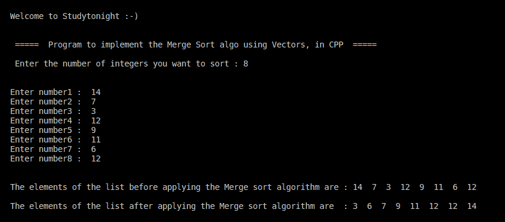

> 原文:[https://www . study south . com/CPP-programs/CPP-program-for-merge-sort](https://www.studytonight.com/cpp-programs/cpp-program-for-merge-sort)

# 用于合并排序的 C++程序

大家好！

在本教程中，我们将学习如何用 C++编程语言实现**合并排序算法**。

为了从头开始理解**合并排序算法**，我们强烈建议您首先访问我们的教程，因为我们已经介绍了它的逐步实现，这里:[https://www.studytonight.com/data-structures/merge-sort](https://www.studytonight.com/data-structures/merge-sort)

<u>**代号:**</u>

```cpp
#include <iostream>

#include<vector>

using namespace std;

//Separate method to print the list provided by the calling method
void printElems(vector < int > list) {
    int i;
    int len = list.size();
    for (i = 0; i < len; i++)
        cout << list[i] << "  ";

}

//This method is used to merge the two individual sorted lists into a single sorted list
void merge(vector < int > & a, int low, int high, int mid) {
    int i, j, k;

    int c[50];

    i = low;
    k = low;
    j = mid + 1;

    while (i <= mid && j <= high) {
        if (a[i] < a[j]) {
            //copying the elements from arr a to arr c.
            c[k] = a[i];
            k++;
            i++;
        } else {
            //copying the elements from arr a to arr c.
            c[k] = a[j];
            k++;
            j++;
        }
    }
    while (i <= mid) {
        //copying the elements from arr a to arr c.
        c[k] = a[i];
        k++;
        i++;
    }
    while (j <= high) {
        //copying the elements from arr a to arr c.
        c[k] = a[j];
        k++;
        j++;
    }
    for (i = low; i < k; i++) {
        //copying remaining elements from arr c to arr a
        a[i] = c[i];
    }

}

//The recursive Merge Sort logic 
void mergeSort(vector < int > & a, int low, int high) {
    int mid;
    if (low < high) {
        //In Merge sort, the pivot element is always the middle element that divides the list into two equal parts
        mid = (low + high) / 2;

        //Calling Merge sort for the elements on the left of the pivot
        mergeSort(a, low, mid);

        //Calling Merge sort for the elements on the right of the pivot
        mergeSort(a, mid + 1, high);

        //Calling to the merge method to form a single sorted list
        merge(a, low, high, mid);
    }

}

int main() {
    int i, num, n;

    //Declaring the Vector to store the integer elements to be sorted
    vector < int > v;

    cout << "\n\nWelcome to Studytonight :-)\n\n\n";
    cout << " =====  Program to implement the Merge Sort algo using Vectors, in CPP  ===== \n\n";

    //taking input from the command line (user)
    cout << " Enter the number of integers you want to sort : ";
    cin >> n;
    cout << "\n\n";

    for (i = 0; i < n; i++) {
        cout << "Enter number" << i + 1 << " :  ";
        cin >> num;
        v.push_back(num);

    }

    cout << "\n\nThe elements of the list before applying the Merge sort algorithm are : ";

    //Calling the method to print the actual list
    printElems(v);

    //Calling the Merge sort algorithm for the entire list indexed from 0 to n-1
    mergeSort(v, 0, n - 1);

    cout << "\n\nThe elements of the list after applying the Merge sort algorithm are  : ";

    //Calling the method to print the sorted list
    printElems(v);

    cout << "\n\n\n";

    return 0;
}
```

<u>**输出:**</u>



如有任何疑问，欢迎在下方评论区提问！

**继续学习:**

* * *

* * *