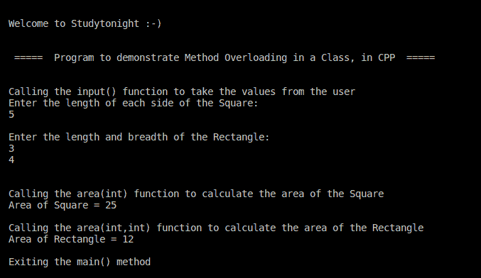

> 原文:[https://www . study south . com/CPP-programs/CPP-method-overload-program](https://www.studytonight.com/cpp-programs/cpp-method-overloading-program)

# C++方法重载程序

大家好！

在本教程中，我们将学习如何用 C++编程语言**演示方法重载**的概念。

为了理解 CPP 中方法或函数重载的概念，我们将推荐您访问这里:[函数重写](https://www.studytonight.com/cpp/function-overloading.php)，我们已经从头开始解释了。

<u>**代号:**</u>

```cpp
#include <iostream>

#include <vector>

using namespace std;

//defining the class shape to overload the method area() on the basis of number of parameters.
class shape {

    //declaring member variables
    public:
        int l, b, s;

    //defining member function or methods
    public:
        void input() {
            cout << "Enter the length of each side of the Square: \n";
            cin >> s;
            cout << "\n";
            cout << "Enter the length and breadth of the Rectangle: \n";
            cin >> l >> b;
            cout << "\n";
        }

    //Demonstrating Method Overloading
    public:
        void area(int side) {
            cout << "Area of Square = " << side * side;
            cout << "\n";
        }

    void area(int length, int breadth) {
        cout << "Area of Rectangle = " << length * breadth;
        cout << "\n";
    }
};

//Defining the main method to access the members of the class
int main() {
    cout << "\n\nWelcome to Studytonight :-)\n\n\n";
    cout << " =====  Program to demonstrate Method Overloading in a Class, in CPP  ===== \n\n";

    //Declaring class object to access class members from outside the class
    shape sh;

    cout << "\nCalling the input() function to take the values from the user\n";
    sh.input();

    cout << "\nCalling the area(int) function to calculate the area of the Square\n";
    sh.area(sh.s);

    cout << "\nCalling the area(int,int) function to calculate the area of the Rectangle\n";
    sh.area(sh.l, sh.b);

    cout << "\nExiting the main() method\n\n\n";

    return 0;
}
```

<u>**输出:**</u>



我们希望这篇文章能帮助你更好地理解 C++中方法重载的概念。如有任何疑问，请随时通过下面的评论区联系我们。

**继续学习:**

* * *

* * *