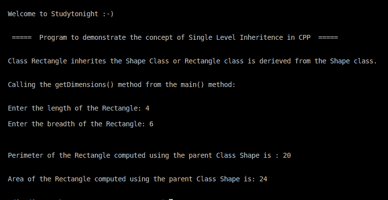

# C++单层继承程序

> 原文：<https://www.studytonight.com/cpp-programs/cpp-single-level-inheritance-program>

大家好！

在本教程中，我们将学习如何用 C++编程语言**演示单级继承**的概念。

为了理解 CPP 中**继承**和各种**访问修饰符**的概念，我们将推荐您访问这里: [C++继承](https://www.studytonight.com/cpp/overview-of-inheritance.php)，我们已经从头开始解释了。

<u>**代号:**</u>

```cpp
#include <iostream>

using namespace std;

//Class Shape to compute the Area and Perimeter of the Shape it derives
class Shape {
    public:
        float area(float l, float b) {
            return (l * b);
        }

    public:
        float perimeter(float l, float b) {
            return (2 * (l + b));
        }
};

//Rectangle class inherites or is derived from the parent class: Shape.
class Rectangle: private Shape {
    private: float length,
    breadth;

    //Default Constructor of the Rectangle Class
    public: Rectangle(): length(0.0),
    breadth(0.0) {}

    void getDimensions() {
        cout << "\nEnter the length of the Rectangle: ";
        cin >> length;

        cout << "\nEnter the breadth of the Rectangle: ";
        cin >> breadth;
    }

    //Method to Calculate the perimeter of the Rectangle by using the Shape Class
    float perimeter() {
        //Calls the perimeter() method of class Shape and returns it.
        return Shape::perimeter(length, breadth);
    }

    //Method to Calculate the area of the Rectangle by using the Shape Class
    float area() {
        //Calls the area() method of class Shape and returns it.
        return Shape::area(length, breadth);
    }
};

//Defining the main method to access the members of the class
int main() {

    cout << "\n\nWelcome to Studytonight :-)\n\n\n";
    cout << " =====  Program to demonstrate the concept of Single Level Inheritence in CPP  ===== \n\n";

    //Declaring the Class objects to access the class members
    Rectangle rect;
    cout << "\nClass Rectangle inherites the Shape Class or Rectangle class is derieved from the Shape class.\n\n";

    cout << "\nCalling the getDimensions() method from the main() method:\n\n";

    rect.getDimensions();
    cout << "\n\n";

    cout << "\nPerimeter of the Rectangle computed using the parent Class Shape is : " << rect.perimeter() << "\n\n\n";
    cout << "Area of the Rectangle computed using the parent Class Shape is: " << rect.area();

    cout << "\n\n\n";

    return 0;
}
```

<u>**输出:**</u>



我们希望这篇文章能帮助你更好地理解 C++中继承和访问修饰符的概念。如有任何疑问，请随时通过下面的评论区联系我们。

**继续学习:**

* * *

* * *