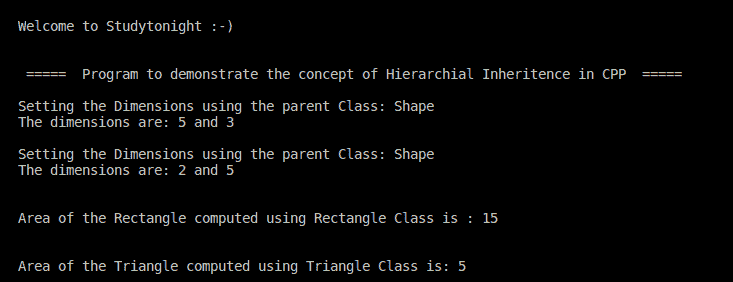

> 原文:[https://www . study south . com/CPP-programs/CPP-分层-继承-程序](https://www.studytonight.com/cpp-programs/cpp-hierarchical-inheritance-program)

# C++层次继承程序

大家好！

在本教程中，我们将学习如何用 C++编程语言**演示层次继承**的概念。

为了理解 CPP 中的层次继承的概念，我们将推荐您访问这里: [C++类型的继承](https://www.studytonight.com/cpp/types-of-inheritance.php)，我们已经从头开始解释了它。

<u>**代号:**</u>

```cpp
#include <iostream>

using namespace std;

//defining the class Shape to demonstrate the concept of Hierarchial Inheritence in CPP
class Shape {
    //protected member variables are only accessible within the class and its descendent classes
    protected:
        float width, height;

    //public members are accessible everywhere
    public:
        void setDimensions(float w, float h) {
            cout << "Setting the Dimensions using the parent Class: Shape\n";
            cout << "The dimensions are: " << w << " and " << h << "\n\n";

            width = w;
            height = h;
        }
};

//Class Rectangle inherites the Shape class
class Rectangle: public Shape {
    //Method Overriding
    public: float area() {
        return (width * height);
    }
};

//Class Triangle inherites the Shape class
class Triangle: public Shape {
    //Method Overriding
    public: float area() {
        return (width * height / 2);
    }
};

//Defining the main method to access the members of the class
int main() {

    cout << "\n\nWelcome to Studytonight :-)\n\n\n";
    cout << " =====  Program to demonstrate the concept of Hierarchial Inheritence in CPP  ===== \n\n";

    //Declaring the Class objects to access the class members
    Rectangle rectangle;
    Triangle triangle;

    rectangle.setDimensions(5, 3);
    triangle.setDimensions(2, 5);

    cout << "\nArea of the Rectangle computed using Rectangle Class is : " << rectangle.area() << "\n\n\n";
    cout << "Area of the Triangle computed using Triangle Class is: " << triangle.area();

    cout << "\n\n\n";

    return 0;
}
```

<u>**输出:**</u>



我们希望这篇文章能帮助你更好地理解 C++中层次继承的概念。如有任何疑问，请随时通过下面的评论区联系我们。

**继续学习:**

* * *

* * *