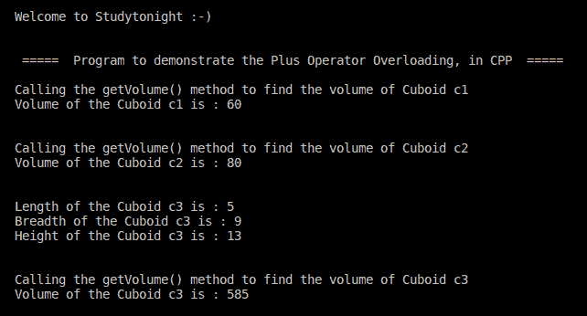

# C++ 加号(`+`)运算符重载程序

> 原文：<https://www.studytonight.com/cpp-programs/cpp-plus-operator-overloading-program>

大家好！

在本教程中，我们将学习如何用 C++ 编程语言**演示`+`运算符重载**的概念。

要了解 CPP 中运算符重载的概念，我们将推荐您访问这里: [C++ 运算符重载](https://www.studytonight.com/cpp/operator-overloading.php)，我们已经从头开始解释了。

**代号:**

```cpp
#include <iostream>

using namespace std;

//defining the class Cuboid to demonstrate the concept of Plus Operator Overloading in CPP
class Cuboid {
    //Declaring class member variables as public to access from outside the class
    public:
        double length; // Length of Cuboid
    double breadth; // Breadth of Cuboid
    double height; // Height of Cuboid

    public:
        double getVolume(void) {
            return length * breadth * height;
        }
    void setLength(double l) {
        length = l;
    }

    void setBreadth(double b) {
        breadth = b;
    }

    void setHeight(double h) {
        height = h;
    }

    // Overload + operator to add two Cuboid objects with each other.
    Cuboid operator + (const Cuboid & c) {
        Cuboid cuboid;
        cuboid.length = this -> length + c.length;
        cuboid.breadth = this -> breadth + c.breadth;
        cuboid.height = this -> height + c.height;
        return cuboid;
    }
};

//Defining the main method to access the members of the class
int main() {

    cout << "\n\nWelcome to Studytonight :-)\n\n\n";
    cout << " =====  Program to demonstrate the Plus Operator Overloading, in CPP  ===== \n\n";

    //Declaring the Class objects to access the class members
    Cuboid c1;
    Cuboid c2;
    Cuboid c3;

    //To store the volume of the Cuboid
    double volume = 0.0;

    // Setting the length, breadth and height for the first Cuboid object: c1
    c1.setLength(3.0);
    c1.setBreadth(4.0);
    c1.setHeight(5.0);

    // Setting the length, breadth and height for the second Cuboid object: c2
    c2.setLength(2.0);
    c2.setBreadth(5.0);
    c2.setHeight(8.0);

    // Finding the Volume of the first Cuboid: c1
    cout << "Calling the getVolume() method to find the volume of Cuboid c1\n";
    volume = c1.getVolume();
    cout << "Volume of the Cuboid c1 is : " << volume << "\n\n\n";

    // Finding the Volume of the first Cuboid: c1
    cout << "Calling the getVolume() method to find the volume of Cuboid c2\n";
    volume = c2.getVolume();
    cout << "Volume of the Cuboid c2 is : " << volume << "\n\n\n";

    // Adding the two Cuboid objects c1 and c2 to form the third object c3:
    c3 = c1 + c2;

    // Printing the dimensions of the third Cuboid: c3
    cout << "Length of the Cuboid c3 is : " << c3.length << endl;
    cout << "Breadth of the Cuboid c3 is : " << c3.breadth << endl;
    cout << "Height of the Cuboid c3 is : " << c3.height << endl;

    // Finding the Volume of the third Cuboid: c3
    cout << "\n\nCalling the getVolume() method to find the volume of Cuboid c3\n";
    volume = c3.getVolume();
    cout << "Volume of the Cuboid c3 is : " << volume << endl;
    cout << "\n\n\n";

    return 0;
}
```

**输出:**



我们希望这篇文章能帮助你更好地理解 C++ 中运算符重载的概念。如有任何疑问，请随时通过下面的评论区联系我们。

**继续学习:**

* * *

* * *