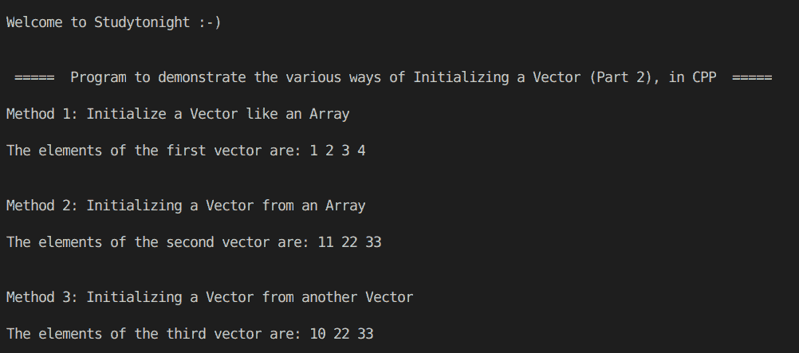

# C++ 程序：使用 STL 初始化向量（第二部分）

> 原文：<https://www.studytonight.com/cpp-programs/cpp-initializing-a-vector-in-stl-part-2-program>

大家好！

在本教程中，我们将学习用 C++ 编程语言初始化向量的各种方法。

## 什么是向量？

向量与动态数组相同，能够在插入或删除元素时自动调整自身大小。这使得它们比固定大小且本质上是静态的普通数组更有优势。

要了解更多关于 CPP 中的向量，我们将推荐您访问 [C++ STL 向量](https://www.studytonight.com/cpp/stl/stl-container-vector)

为了更好地理解，请参考下面给出的注释良好的 C++ 代码。

**代号:**

```cpp
#include <iostream>
#include <bits/stdc++.h>

using namespace std;

int main()
{
    cout << "\n\nWelcome to Studytonight :-)\n\n\n";
    cout << " =====  Program to demonstrate the various ways of Initializing a Vector (Part 2), in CPP  ===== \n\n";

    cout << "Method 1: Initialize a Vector like an Array\n\n";

    //create and initialize a vector
    vector<int> v{1, 2, 3, 4};

    //prining the vector
    cout << "The elements of the first vector are: ";

    for (int i : v)
    {
        cout << i << " ";
    }

    cout << "\n\n\nMethod 2: Initializing a Vector from an Array\n\n";

    //creating and initializing an array
    int a[] = {11, 22, 33};

    //calculating number of elements in an array
    int n = sizeof(a) / sizeof(a[0]);

    //creating and initializing a vector with the array elements
    vector<int> v1(a, a + n);

    //prining the vector
    cout << "The elements of the second vector are: ";
    for (int i : v1)
    {
        cout << i << " ";
    }

    cout << "\n\n\nMethod 3: Initializing a Vector from another Vector\n\n";

    //creating and initializing the source vector
    vector<int> a1 = {10, 22, 33};

    //creating and initializing a second vector with the elements of the first vector
    vector<int> b(a1.begin(), a1.end());

    //prining the vector
    cout << "The elements of the third vector are: ";
    for (int i : b)
    {
        cout << i << " ";
    }

    cout << "\n\n\n";

    return 0;
} 
```

**输出:**



我们希望这篇文章能帮助你更好地理解向量的概念及其在 CPP 中的实现。如有任何疑问，请随时通过下面的评论区联系我们。

**继续学习:**

* * *

* * *