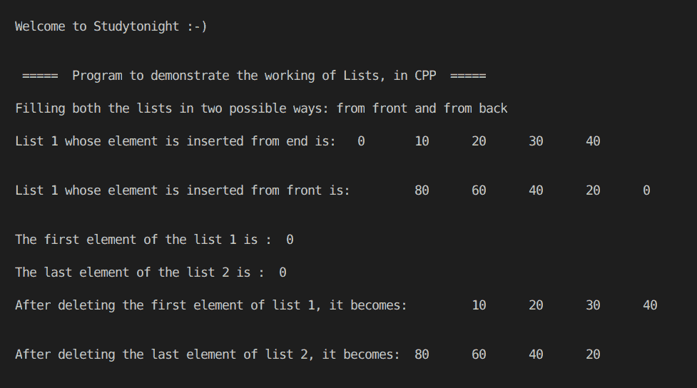

# 使用 STL 列表的 C++程序(第 1 部分)

> 原文：<https://www.studytonight.com/cpp-programs/cpp-using-stl-lists-part-1-program>

大家好！

在本教程中，我们将学习 C++编程语言中列表(第 1 部分)的**工作方式。**

为了理解 C++中列表的基本功能，我们将推荐您访问[https://www.studytonight.com/cpp/stl/stl-container-list](https://www.studytonight.com/cpp/stl/stl-container-list)，在那里我们从头开始详细解释了这个概念。

为了更好地理解它的实现，请参考下面给出的评论良好的 CPP 代码。

<u>**代号:**</u>

```cpp
#include <iostream>
#include <bits/stdc++.h>

using namespace std;

//Function to print the elements of the list
void show(list<int> &l)
{
    //Defining an iterator for the list
    list<int>::iterator i;

    for (i = l.begin(); i != l.end(); i++)
    {
        cout << "\t" << *i;
    }

    cout << endl;
}

int main()
{
    cout << "\n\nWelcome to Studytonight :-)\n\n\n";
    cout << " =====  Program to demonstrate the working of Lists (Part 1), in CPP  ===== \n\n";

    int i;

    //List declaration (list of integers)
    list<int> l1, l2;

    //Filling the elements
    cout << "Filling both the lists in two possible ways: from front and from back\n\n";
    for (i = 0; i < 5; i++)
    {
        l1.push_back(i * 10);  //inserting elements from end
        l2.push_front(i * 20); //inserting elements from front
    }

    cout << "List 1 whose element is inserted from end is: ";
    show(l1);

    cout << "\n\nList 1 whose element is inserted from front is: ";
    show(l2);

    cout << "\n\nThe first element of the list 1 is :  " << l1.front();

    cout << "\n\nThe last element of the list 2 is :  " << l2.back();

    cout << "\n\nAfter deleting the first element of list 1, it becomes: ";
    l1.pop_front();
    show(l1);

    cout << "\n\nAfter deleting the last element of list 2, it becomes: ";
    l2.pop_back();
    show(l2);

    cout << "\n\n\n";

    return 0;
} 
```

<u>**输出:**</u>



我们希望这篇文章能帮助你更好地理解列表的概念及其在 C++中的实现。如有任何疑问，请随时通过下面的评论区联系我们。

**继续学习:**

* * *

* * *