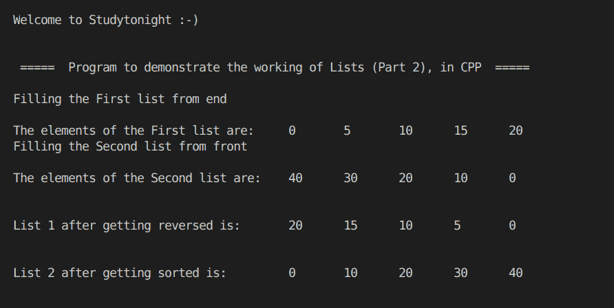

# 使用 STL 列表的 C++程序(第 2 部分)

> 原文：<https://www.studytonight.com/cpp-programs/cpp-using-stl-lists-part-2-program>

大家好！

在本教程中，我们将学习 C++编程语言中列表(第 2 部分)的**工作方式。**

我们已经解释并实现了列表上的各种功能，如**`reverse()``sort()``push_back()``push_front()`等。**

 **为了理解 C++中列表的基本功能，我们将推荐您访问[https://www.studytonight.com/cpp/stl/stl-container-list](https://www.studytonight.com/cpp/stl/stl-container-list)，在那里我们从头开始详细解释了这个概念。

为了更好地理解它的实现，请参考下面给出的评论很好的 CPP 代码。

<u>**代号:**</u>

```cpp
#include <iostream>
#include <bits/stdc++.h>

using namespace std;

//Function to print the elements of the list
void show(list<int> &l)
{
    //Defining an iterator for the list
    list<int>::iterator i;

    for (i = l.begin(); i != l.end(); i++)
    {
        cout << "\t" << *i;
    }

    cout << endl;
}

int main()
{
    cout << "\n\nWelcome to Studytonight :-)\n\n\n";
    cout << " =====  Program to demonstrate the working of Lists (Part 2), in CPP  ===== \n\n";

    int i;

    //List declaration (list of integers)
    list<int> l1, l2;

    //Filling the elements
    cout << "Filling the First list from end\n\n";
    for (i = 0; i < 5; i++)
    {
        l1.push_back(i * 5); //inserting elements from end
    }

    cout << "The elements of the First list are: ";
    show(l1);

    //Filling the elements
    cout << "Filling the Second list from front\n\n";
    for (i = 0; i < 5; i++)
    {
        l2.push_front(i * 10); //inserting elements from front
    }

    cout << "The elements of the Second list are: ";
    show(l2);

    cout << "\n\nList 1 after getting reversed is: ";
    l1.reverse();
    show(l1);

    cout << "\n\nList 2 after getting sorted is: ";
    l2.sort();
    show(l2);

    cout << "\n\n\n";

    return 0;
} 
```

<u>**输出:**</u>



我们希望这篇文章能帮助你更好地理解列表的概念及其在 C++中的实现。如有任何疑问，请随时通过下面的评论区联系我们。

**继续学习:**** * * *

* * *