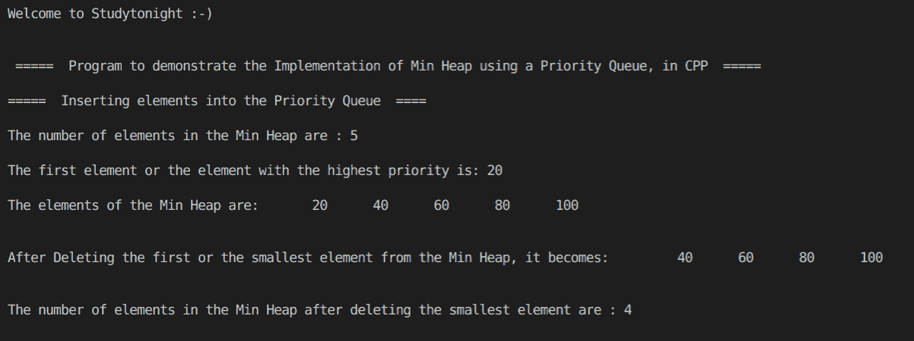

# 用优先级队列程序实现最小堆

> 原文：<https://www.studytonight.com/cpp-programs/cpp-implementing-min-heap-using-priority-queue-program>

大家好！

在本教程中，我们将学习最小堆的**概念，并使用 C++ 编程语言中的优先级队列**来实现它。

## 最小堆数据结构:

堆数据结构始终是一个完整的二叉树，这意味着树的所有级别都被完全填充。在最小堆中，每个节点的子节点都大于它们的父节点。

为了了解 CPP 中优先级队列的基本功能，我们将推荐您访问 [C++ STL 优先级队列](https://www.studytonight.com/cpp/stl/stl-container-priority-queue)，在这里我们从头开始详细解释了这个概念。

为了更好地理解它的实现，请参考下面给出的注释良好的 C++ 代码。

**代号:**

```cpp
#include <iostream>
#include <bits/stdc++.h>

using namespace std;

//Function to print the elements of the Min Heap
void show(priority_queue<int, vector<int>, greater<int>> q)
{
    //Copying the Priority Queue into another to maintain the original Priority Queue
    priority_queue<int, vector<int>, greater<int>> mh = q;

    while (!mh.empty())
    {
        cout << "\t" << mh.top(); //printing the top most element
        mh.pop();                 //deleting the top most element to move to the next
    }

    cout << endl;
}

int main()
{
    cout << "\n\nWelcome to Studytonight :-)\n\n\n";
    cout << " =====  Program to demonstrate the Implementation of Min Heap using a Priority Queue, in CPP  ===== \n\n";

    int i;

    /* Declaring a Priority Queue of integers
    Note: by default the priority queue is Max heap in c++ : priority_queue<int> q
    To create a Min heap, follow the below declaration of the Priority Queue
    */
    priority_queue<int, vector<int>, greater<int>> minHeap;

    //Filling the elements into the Priority Queue
    cout << "=====  Inserting elements into the Priority Queue  ====\n\n";
    for (i = 1; i < 6; i++)
    {
        minHeap.push(i * 20);
    }

    cout << "The number of elements in the Min Heap are : " << minHeap.size();
    ;

    cout << "\n\nThe first element or the element with the highest priority is: " << minHeap.top();
    ;

    cout << "\n\nThe elements of the Min Heap are: ";
    show(minHeap);

    cout << "\n\nAfter Deleting the first or the smallest element from the Min Heap, it becomes: ";
    minHeap.pop();
    show(minHeap);

    cout << "\n\nThe number of elements in the Min Heap after deleting the smallest element are : " << minHeap.size();
    ;

    cout << "\n\n\n";

    return 0;
} 
```

**输出:**



我们希望这篇文章能帮助你更好地理解最小堆的概念，以及它在 C++ 中使用优先级队列的实现。如有任何疑问，请随时通过下面的评论区联系我们。

**继续学习:**

* * *

* * *