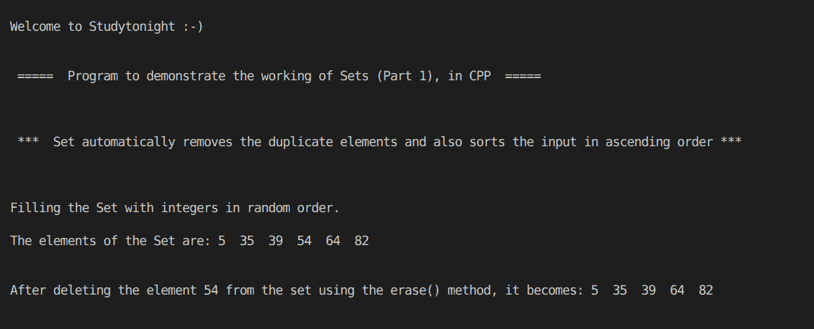

> 原文:[https://www . study south . com/CPP-programs/CPP-STL-set-program-part-1](https://www.studytonight.com/cpp-programs/cpp-stl-sets-program-part-1)

# C++ STL 集合程序(上)

大家好！

在本教程中，我们将学习 C++编程语言中集合的**工作及其实现**。

## 什么是集合？

在编程中，集合用于存储列表的唯一值，并自动为其元素提供排序。默认情况下，顺序是升序。

使用`insert()`方法插入元素。如果同一个值被插入多次，集合会自动删除重复项，并且只存储该元素的单个副本。

使用`erase()`方法删除集合的元素。

为了更好地理解它的实现，请参考下面给出的注释良好的 C++代码。

<u>**代号:**</u>

```cpp
#include <iostream>
#include <bits/stdc++.h>

using namespace std;

//Function to print the elements of the set using an iterator
void show(set<int> s)
{
    //declaring an iterator to iterate through the set
    set<int>::iterator i;

    for (i = s.begin(); i != s.end(); i++)
    {
        cout << *i << "  "; //accessing the elements of the set using * as i stores the address to each element
    }

    cout << endl;
}

int main()
{
    cout << "\n\nWelcome to Studytonight :-)\n\n\n";
    cout << " =====  Program to demonstrate the working of Sets (Part 1), in CPP  ===== \n\n\n\n";

    cout << " ***  Set automatically removes the duplicate elements and also sorts the input in ascending order *** \n\n";

    //Set declaration (Set of integers)
    set<int> s;

    //Filling the elements by using the insert() method.
    cout << "\n\nFilling the Set with integers in random order."; //Set automatically stores them in order

    s.insert(5);
    s.insert(39);
    s.insert(64);
    s.insert(82);
    s.insert(35);
    s.insert(54);

    cout << "\n\nThe elements of the Set are: ";
    show(s);

    cout << "\n\nAfter deleting the element 54 from the set using the erase() method, it becomes: ";
    s.erase(54);
    show(s);

    cout << "\n\n\n";

    return 0;
} 
```

<u>**输出:**</u>



我们希望这篇文章能帮助你更好地理解 Set 的概念及其在 C++中的实现。如有任何疑问，请随时通过下面的评论区联系我们。

**继续学习:**

* * *

* * *