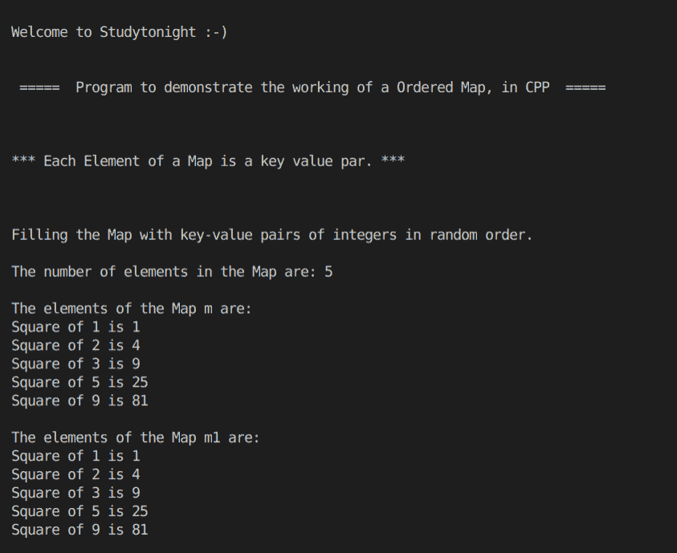

# C++ 程序：使用 STL 映射

> 原文：<https://www.studytonight.com/cpp-programs/cpp-using-stl-map-program>

大家好！

在本教程中，我们将学习 C++ 编程语言中 STL 中 Map 的**概念。**

要了解 STL 中映射容器的基本功能，我们将推荐您访问 [C++ STL 映射](https://www.studytonight.com/cpp/stl/stl-container-map)，我们已经从头开始详细解释了这个概念。

为了更好地理解它的实现，请参考下面给出的注释良好的 C++ 代码。

**代号:**

```cpp
#include <iostream>
#include <bits/stdc++.h>

using namespace std;

int main()
{
    cout << "\n\nWelcome to Studytonight :-)\n\n\n";
    cout << " =====  Program to demonstrate the working of a Ordered Map, in CPP  ===== \n\n\n\n";

    cout << "*** Each Element of a Map is a key value par. *** \n\n";

    //Map declaration (Map with key and value both as integers)
    map<int, int> m;

    //Filling the elements by using the insert() method.
    cout << "\n\nFilling the Map with key-value pairs of integers in random order."; //Map automatically stores them in increasing order of keys

    //make_pair() is used to insert a key value pair into the map
    m.insert(make_pair(3, 9));
    m.insert(make_pair(2, 4));
    m.insert(make_pair(5, 25));
    m.insert(make_pair(9, 81));
    m.insert(make_pair(1, 1));

    cout << "\n\nThe number of elements in the Map are: " << m.size();

    cout << "\n\nThe elements of the Map m are: ";

    map<int, int>::iterator i;

    for (i = m.begin(); i != m.end(); i++)
    {
        cout << "\nSquare of " << i->first << " is " << i->second;
    }

    //Initializing a map with the elements of another map

    map<int, int> m1(m.begin(), m.end());

    //Printing the copied map
    cout << "\n\nThe elements of the Map m1 are: ";

    for (i = m1.begin(); i != m1.end(); i++)
    {
        cout << "\nSquare of " << i->first << " is " << i->second;
    }

    cout << "\n\n\n";

    return 0;
} 
```

**输出:**



我们希望这篇文章能帮助你更好地理解 STL 中映射容器的概念及其在 CPP 中的实现。如有任何疑问，请随时通过下面的评论区联系我们。

**继续学习:**

* * *

* * *