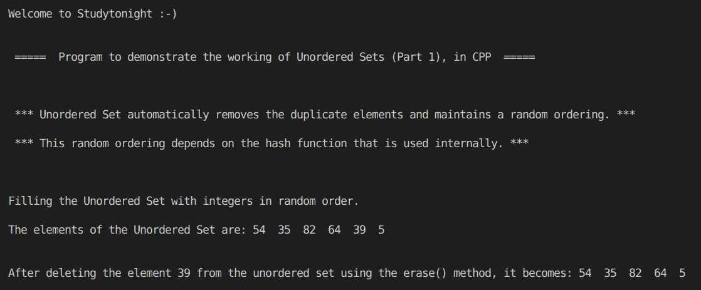

# C++使用 STL 无序集程序

> 原文：<https://www.studytonight.com/cpp-programs/cpp-using-stl-unordered-set-program>

大家好！

在本教程中，我们将学习 C++编程语言中无序集的**工作及其实现**。

## 什么是集合？

在编程中，集合用于存储列表的唯一值，并自动为其元素提供排序。默认情况下，顺序是升序。

使用`insert()`方法插入元素。如果同一个值被插入多次，集合会自动删除重复项，并且只存储该元素的单个副本。

使用`erase()`方法删除集合的元素。

## 什么是无序集？

无序集还通过删除重复项来仅存储元素的单个副本，但不会像集中那样自动对元素进行排序。

无序集在内部使用哈希表，因此排序是随机的，取决于内部使用的哈希函数。

为了更好地理解它的实现，请参考下面给出的注释良好的 C++代码。

<u>**代号:**</u>

```cpp
#include <iostream>
#include <bits/stdc++.h>

using namespace std;

//Function to print the elements of the unordered set using an iterator
void show(unordered_set<int> s)
{
    //declaring an iterator to iterate through the unordered set
    unordered_set<int>::iterator i;

    for (i = s.begin(); i != s.end(); i++)
    {
        cout << *i << "  "; //accessing the elements of the unordered set using * as i stores the address to each element
    }

    cout << endl;
}

int main()
{
    cout << "\n\nWelcome to Studytonight :-)\n\n\n";
    cout << " =====  Program to demonstrate the working of Unordered Sets (Part 1), in CPP  ===== \n\n\n\n";

    cout << " *** Unordered Set automatically removes the duplicate elements and maintains a random ordering. *** \n\n";

    cout << " *** This random ordering depends on the hash function that is used internally. *** \n\n";

    //Unordered Set declaration (Unordered Set of integers)
    unordered_set<int> s;

    //Filling the elements by using the insert() method.
    cout << "\n\nFilling the Unordered Set with integers in random order."; //Unlike Set, this is not automatically sorted

    s.insert(5);
    s.insert(39);
    s.insert(64);
    s.insert(82);
    s.insert(35);
    s.insert(54);

    cout << "\n\nThe elements of the Unordered Set are: ";
    show(s);

    cout << "\n\nAfter deleting the element 39 from the unordered set using the erase() method, it becomes: ";
    s.erase(39);
    show(s);

    cout << "\n\n\n";

    return 0;
} 
```

<u>**输出:**</u>



我们希望这篇文章能帮助你更好地理解无序集的概念及其在 C++中的实现。如有任何疑问，请随时通过下面的评论区联系我们。

**继续学习:**

* * *

* * *