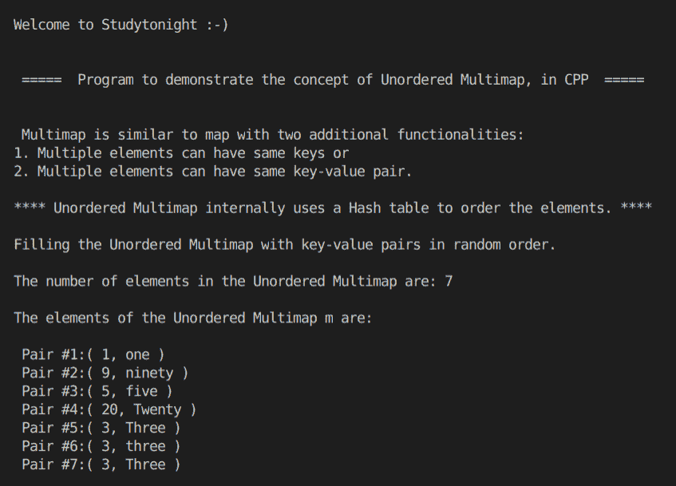

# C++ 使用 STL 无序多映射程序

> 原文：<https://www.studytonight.com/cpp-programs/cpp-using-stl-unordered-multimap-program>

大家好！

在本教程中，我们将学习 C++ 编程语言中 STL 中多映射的**概念。**

要了解 STL 中**地图容器**的基本功能，我们将推荐您访问[https://www.studytonight.com/cpp/stl/stl-container-map](https://www.studytonight.com/cpp/stl/stl-container-map)，我们已经从头开始详细解释了这个概念。

### 什么是 Multimap？

**多地图**类似于地图，具有两个附加功能:

1.  多个元素可以有相同或重复的键。

2.  多个元素可以有相同或重复的键值对。

## 什么是无序多重映射？

它与多映射相同，只是它以随机顺序存储键值对，而不像多映射那样以键的排序顺序存储元素。

为了更好地理解它的实现，请参考下面给出的注释良好的 C++ 代码。

<u>**代号:**</u>

```cpp
#include <iostream>
#include <bits/stdc++.h>

using namespace std;

void showMultimap(unordered_multimap<int, string> mm)
{
    unordered_multimap<int, string>::iterator i;
    int j = 0;

    for (i = mm.begin(); i != mm.end(); i++)
    {
        cout << " Pair #" << ++j << ":( " << i->first << ", " << i->second << " )\n";
    }
}

int main()
{
    cout << "\n\nWelcome to Studytonight :-)\n\n\n";
    cout << " =====  Program to demonstrate the concept of Unordered Multimap, in CPP  ===== \n\n\n";

    cout << " Multimap is similar to map with two additional functionalities: \n1\. Multiple elements can have same keys or \n2\. Multiple elements can have same key-value pair.\n\n";

    cout << "**** Unordered Multimap internally uses a Hash table to order the elements. ****\n\n";

    //Unordered Multimap declaration (Unordered Multimap with key as integer and value as string)
    unordered_multimap<int, string> m;

    //Filling the elements by using the insert() method.
    cout << "Filling the Unordered Multimap with key-value pairs in random order."; //Unordered Multimap stores them in random order

    //make_pair() is used to insert a key value pair into the multimap: similar to map[key]=value format
    m.insert(make_pair(3, "Three"));
    m.insert(make_pair(20, "Twenty"));
    m.insert(make_pair(5, "five"));
    m.insert(make_pair(9, "ninety"));
    m.insert(make_pair(1, "one"));
    m.insert(make_pair(3, "three")); //duplicate key with different value
    m.insert(make_pair(3, "Three")); //the duplicate key-value pair

    cout << "\n\nThe number of elements in the Unordered Multimap are: " << m.size();

    cout << "\n\nThe elements of the Unordered Multimap m are:\n\n";
    showMultimap(m);

    cout << "\n\n\n";

    return 0;
} 
```

<u>**输出:**</u>



我们希望这篇文章能帮助你更好地理解 STL 中无序多映射容器的概念及其在 CPP 中的实现。如有任何疑问，请随时通过下面的评论区联系我们。

**继续学习:**

* * *

* * *