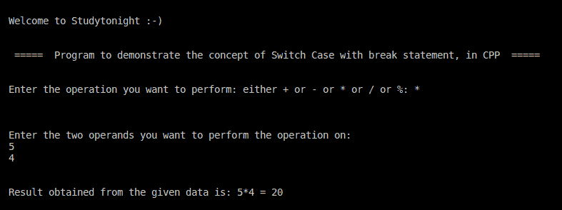

# 带中断语句程序的 C++ 开关案例

> 原文：<https://www.studytonight.com/cpp-programs/cpp-switch-case-with-break-statement-program>

大家好！

在本教程中，我们将学习如何用 C++ 编程语言用 break 语句**演示 Switch Case 的概念。**

## C++ 开关案例:

在编程中，`switch-case`只是多个 if-else 块的一种替代方案。它仅在满足特定条件时用于执行代码块。break 语句用于阻止代码流进入剩余的块，从而使其在满足单个条件时直接移出开关块。

为了更好地理解，我们强烈建议您访问我们在这里的一个帖子:[https://www.studytonight.com/c/programs/basic/switch-case](https://www.studytonight.com/c/programs/basic/switch-case)，我们在那里详细讨论了这个概念。

<u>**代号:**</u>

```cpp
#include <iostream>
#include <vector>
using namespace std;

int main()
{
    cout << "\n\nWelcome to Studytonight :-)\n\n\n";
    cout << " =====  Program to demonstrate the concept of Switch Case with break statement, in CPP  ===== \n\n";

    //variable to store the operation to be performed
    char operation;

    //variable to store the operands
    int n1, n2, result;

    cout << "\nEnter the operation you want to perform: either + or - or * or / or %: ";
    cin >> operation;

    cout << "\n\n\nEnter the two operands you want to perform the operation on: \n";
    cin >> n1 >> n2;

    //Logic of Switch case with break statement
    switch (operation)
    {
    case '+':
        result = n1 + n2;
        break;
    case '-':
        result = n1 - n2;
        break;
    case '*':
        result = n1 * n2;
        break;
    case '/':
        result = n1 / n2;
        break;
    case '%':
        result = n1 % n2;
        break;

    default:
        cout << "\n\nPlease Enter a Valid Operation from the mentioned list";
        break;
    }

    cout << "\n\nResult obtained from the given data is: " << n1 << operation << n2 << " = " << result << "\n\n\n ";
    return 0;
} 
```

<u>**输出:**</u>



我们希望这篇文章能帮助你更好地理解 Switch Case 的概念，包括 break 语句及其在 C++ 中的实现。如有任何疑问，请随时通过下面的评论区联系我们。

**继续学习:**

* * *

* * *