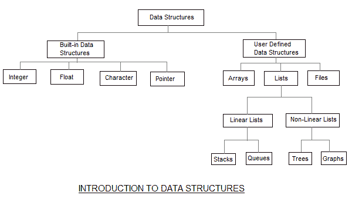

# 数据结构和算法导论

> 原文：<https://www.studytonight.com/data-structures/introduction-to-data-structures>

数据结构是一种收集和组织数据的方式，我们可以有效地对这些数据执行操作。数据结构是根据某种关系呈现数据元素，以便更好地组织和存储。例如，我们有一些数据，玩家的**名字**“Virat”和**年龄** 26。这里的“Virat”是**字符串**数据类型，26 是**整数**数据类型。

我们可以将这些数据组织成类似**玩家**记录的记录，其中会同时包含玩家的姓名和年龄。现在我们可以将玩家的记录收集并存储在一个文件或数据库中作为数据结构。**例如**:“多尼”30，“甘比尔”31，“塞瓦格”33

如果你知道面向对象编程的概念，那么`class`也做同样的事情，它在一个单独的实体下收集不同类型的数据。唯一不同的是，数据结构提供了有效访问和操作数据的技术。

在简单的语言中，数据结构是被编程来存储有序数据的结构，因此可以很容易地对其执行各种操作。它表示要在内存中组织的数据知识。它的设计和实现应该降低复杂性，提高效率。

* * *

## 数据结构的基本类型

如上所述，任何可以存储数据的东西都可以被称为数据结构，因此整型、浮点型、布尔型、字符型等都是数据结构。它们被称为**原始数据结构**。

然后，我们还有一些复杂的数据结构，用于存储大型和连接的数据。**抽象数据结构**的一些例子有:

*   [链表](introduction-to-linked-list)
*   [树](introduction-to-binary-trees)
*   图表
*   [栈](stack-data-structure)、[队列](queue-data-structure)等。

所有这些数据结构都允许我们对数据执行不同的操作。我们根据需要的操作类型来选择这些数据结构。我们将在后面的课程中更详细地研究这些数据结构。

数据结构也可以根据以下特征进行分类:

| 特性 | 描述 |
| 线性的 | 在线性数据结构中，数据项以线性顺序排列。示例:**数组** |
| 非线性的 | 在非线性数据结构中，数据项不是按顺序排列的。示例:**树**，**图** |
| 同质的 | 在同构数据结构中，所有的元素都是相同的类型。示例:**数组** |
| 非均匀的 | 在非同构数据结构中，元素可以是同一类型的，也可以不是同一类型的。示例:**结构** |
| 静态 | 静态数据结构是那些在编译时其大小和结构相关的内存位置是固定的。示例:**数组** |
| 动态的 | 动态结构是那些根据程序需求及其执行而扩展或收缩的结构。此外，它们相关联的存储位置也会改变。示例:**使用指针创建的链表** |

* * *

## 什么是算法？

算法是一组有限的指令或逻辑，按顺序编写，以完成特定的预定义任务。算法不是完整的代码或程序，它只是一个问题的核心逻辑(解决方案)，可以用**伪代码**这样的非正式高层描述来表达，也可以用**流程图**来表达。

每个算法必须满足以下属性:

1.  **输入** -算法应该有 0 个或更多的外部输入。
2.  **输出** -至少应获得 1 个输出。
3.  **明确性** -算法的每一步都要清晰明确。
4.  **有限性** -算法应该有有限步数。
5.  **正确性** -算法的每一步都必须产生正确的输出。

如果一个算法执行起来花费的时间更少，消耗的内存空间更少，那么它就被认为是高效和快速的。算法的性能是根据以下属性来衡量的:

1.  时间复杂性
2.  空间复杂性

* * *

## 空间复杂性

它是算法在执行过程中所需的内存空间量。对于多用户系统和内存有限的情况，必须认真考虑空间复杂性。

算法通常需要空间用于以下组件:

*   **指令空间:**存储程序可执行版本所需的空间。这个空间是固定的，但是根据程序中的代码行数而变化。
*   **数据空间:**存储所有常量和变量(包括临时变量)值所需的空间。
*   **环境空间:**存储恢复暂停功能所需的环境信息所需的空间。

要详细了解空间复杂性，请跳到[空间复杂性](space-complexity-of-algorithms)教程。

* * *

## 时间复杂性

时间复杂性是一种表示程序运行到完成所需时间的方法。一般来说，将所需的时间保持在最短是一个很好的做法，这样我们的算法就可以在尽可能短的时间内完成它的执行。我们将在后面的章节中详细研究[时间复杂度](time-complexity-of-algorithms)。

* * *

**注意:**在深入数据结构之前，你应该对编程有很好的了解，无论是在 [C](/c/) 还是在 [C++](/cpp/) 或者 [Java](/java/) 或者 [Python](/python/) 等等。

* * *

* * *