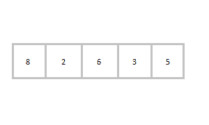

# 线性搜索算法

> 原文:[https://www . study south . com/data-structures/linear-search-algorithm](https://www.studytonight.com/data-structures/linear-search-algorithm)

线性搜索是一种非常基本和简单的搜索算法。在线性搜索中，我们通过从头开始遍历数组来搜索给定数组中的元素或值，直到找到所需的元素或值。

正如我们在[之前的教程](search-algorithms)中了解到的，线性搜索算法的时间复杂度是 **O(n)** ，我们将对其进行分析，看看实现后为什么是 **O(n)** 。

* * *

## 实现线性搜索

以下是我们将遵循的实施步骤:

1.  使用`for`循环遍历数组。
2.  在每次迭代中，将`target`值与数组的当前值进行比较。
    *   如果值匹配，则返回数组的当前索引。
    *   如果值不匹配，请继续下一个数组元素。
3.  如果没有找到匹配，返回`-1`。

要在下面给出的数组中搜索数字 **5** ，线性搜索将从给定数组中的第一个元素开始按顺序一步步进行。



```cpp
/* 
    below we have implemented a simple function 
    for linear search in C

    - values[] => array with all the values
    - target => value to be found
    - n => total number of elements in the array
*/
int linearSearch(int values[], int target, int n)
{
    for(int i = 0; i < n; i++)
    {
        if (values[i] == target) 
        {       
            return i; 
        }
    }
    return -1;
}
```

* * *

### 有输入的一些例子

输入:值[] = {5，34，65，12，77，35}目标= 77 输出:4 输入:值[] = {101，392，1，54，32，22，90，93}目标= 200 输出:-1(未找到)

* * *

### 最后的想法

我们知道你喜欢线性搜索，因为它实现起来非常简单，但是它实际上并没有被使用，因为二分搜索法比线性搜索快得多。所以让我们进入下一个教程，在那里我们将了解更多关于二分搜索法的知识。

* * *

* * *