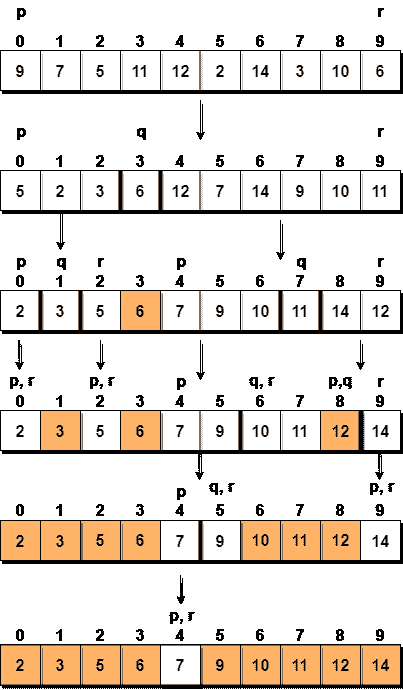

# 快速排序算法

> 原文：<https://www.studytonight.com/data-structures/quick-sort>

快速排序是不同的[排序技术](introduction-to-sorting)之一，它基于**分治**的概念，就像[合并排序](merge-sort)一样。但是在快速排序中，所有繁重的工作(主要工作)都是在**将**数组划分为子数组时完成的，而在合并排序的情况下，所有真正的工作都发生在**合并**子数组的过程中。在快速排序的情况下，合并步骤完全不起作用。

也叫**分区交换排序**。该算法将列表分为三个主要部分:

1.  小于**枢轴**元素的元素
2.  枢轴元素(中心元素)
3.  大于枢轴元素的元素

**Pivot** 元素可以是数组中的任意元素，可以是第一个元素，最后一个元素，也可以是任意随机元素。在本教程中，我们将最右边的元素或最后一个元素作为**轴**。

**例如:**在阵`{52, 37, 63, 14, 17, 8, 6, 25}`中，我们以`25`为**枢**。所以第一遍过后，名单会这样改。

{ `6 8 17 14` **25** `63 37 52` }

因此，在第一次通过后，枢轴将被设置在其位置，所有元素**在其左侧较小**，所有元素**在其右侧较大**。现在`6 8 17 14`和`63 37 52`被认为是两个独立的 sunarrays，相同的递归逻辑将被应用于它们，我们将继续这样做，直到整个数组被排序。

* * *

## 快速排序的工作原理是什么？

以下是快速排序算法中涉及的步骤:

1.  在选择一个元素作为**轴**之后，这是我们这里数组的最后一个索引，我们第一次划分数组。
2.  在快速排序中，我们称之为**分区**。将数组分解为 2 个子数组并不简单，但在划分的情况下，数组元素的位置应使所有小于**枢轴**的元素位于枢轴的左侧，所有大于枢轴的元素位于枢轴的右侧。
3.  并且**枢轴**元件将处于其最终的**分类**位置。
4.  左侧和右侧的元素可能没有排序。
5.  然后我们选取子数组、**轴左侧的元素**、**轴右侧的元素**，通过选择子数组中的**轴**对它们进行**分区**。

让我们考虑一个有值的数组`{9, 7, 5, 11, 12, 2, 14, 3, 10, 6}`

下面，我们有一个图片表示排序将如何快速排序给定的数组。



在第一步中，我们选择最后一个元素作为**枢轴**，在这种情况下是`6`，并调用`partitioning`，因此重新排列数组，使得`6`将被放置在其最终位置，并且在其左侧将有所有小于它的元素，在其右侧，我们将有所有大于它的元素。

然后我们选择左边的子数组和右边的子数组，为它们选择一个**枢轴**，在上图中，我们选择`3`作为左边子数组的枢轴，选择`11`作为右边子数组的枢轴。

我们再次呼吁`partitioning`。

* * *

## 实现快速排序算法

下面我们有一个实现快速排序算法的简单 C 程序:

```cpp
// simple C program for Quick Sort
#include <stdio.h>
int partition(int a[], int beg, int end);  
void quickSort(int a[], int beg, int end);  
void main()  
{  
    int i;  
    int arr[10]={90,23,101,45,65,28,67,89,34,29};  
    quickSort(arr, 0, 9);  
    printf("\n The sorted array is: \n");  
    for(i=0;i<10;i++)  
    printf(" %d\t", arr[i]);  
}  
int partition(int a[], int beg, int end)  
{  
    int left, right, temp, loc, flag;     
    loc = left = beg;  
    right = end;  
    flag = 0;  
    while(flag != 1)  
    {  
        while((a[loc] <= a[right]) && (loc!=right))  
        right--;  
        if(loc==right)  
        flag =1;  
        else if(a[loc]>a[right])  
        {  
            temp = a[loc];  
            a[loc] = a[right];  
            a[right] = temp;  
            loc = right;  
        }  
        if(flag!=1)  
        {  
            while((a[loc] >= a[left]) && (loc!=left))  
            left++;  
            if(loc==left)  
            flag =1;  
            else if(a[loc] < a[left])  
            {  
                temp = a[loc];  
                a[loc] = a[left];  
                a[left] = temp;  
                loc = left;  
            }  
        }  
    }  
    return loc;  
}  
void quickSort(int a[], int beg, int end)  
{  
    int loc;  
    if(beg<end)  
    {  
        loc = partition(a, beg, end);  
        quickSort(a, beg, loc-1);  
        quickSort(a, loc+1, end);  
    }  
} 
```


* * *

### 快速排序的复杂性分析

对于其中**划分**导致子数组不平衡的数组，在左侧没有元素，所有元素大于**枢轴**，因此在右侧。

而如果继续得到不平衡的子阵，那么运行时间就是最坏的情况，也就是`O(n<sup>2</sup>)`

如果**划分**导致几乎相等的子阵，那么运行时间最好，时间复杂度为 **O(n*log n)** 。

最坏情况时间复杂度【大 O】:**O(n<sup>2</sup>)**

最佳案例时间复杂度[大ω]:**O(n * log n)**

平均时间复杂度[大-θ]:**O(n * log n)**

空间复杂度: **O(n*log n)**

我们现在知道，如果分区后产生的子阵**分区**不平衡，快速排序需要更多的时间才能完成。如果有人知道你一直选择最后一个索引作为**枢纽**，他们可以故意给你提供数组，这将导致最坏情况下的快速排序运行时间。

为了避免这种情况，您也可以随机选择**轴**元素。这在算法上不会有什么区别，因为你所需要做的就是从数组中选择一个随机元素，用最后一个索引处的元素交换它，使它成为**枢轴**，然后继续快速排序。

*   快速排序需要的空间很少，只需要`O(n*log n)`额外空间。
*   快速排序不是一种稳定的排序技术，因此它可能会在排序时改变列表中两个相似元素的出现。

现在我们已经学习了快速排序算法，您也可以查看这些排序算法及其应用:

*   [插入输出](insertion-sorting)
*   [选择排序](selection-sorting)
*   [气泡排序](bubble-sort)
*   [合并排序](merge-sort)
*   [堆排序](heap-sort)
*   [计数排序](counting-sort)

* * *

* * *