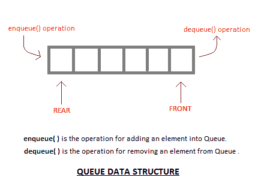
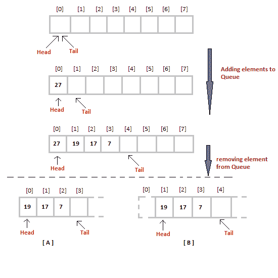

# 什么是队列数据结构？

> 原文:[https://www . study south . com/data-structures/queue-data-structure](https://www.studytonight.com/data-structures/queue-data-structure)

**Queue** 也是抽象数据类型或线性数据结构，就像[栈数据结构](stack-data-structure)一样，其中第一个元素从称为 **REAR** (也称为 **tail** )的一端插入，现有元素的移除发生在称为 **FRONT** (也称为 **head** )的另一端。

在继续阅读队列数据结构之前，请先查看以下主题，以便更好地理解它:

*   [数据结构和算法](introduction-to-data-structures)
*   [堆栈数据结构](stack-data-structure)

这使得队列成为**先进先出**(先进先出)数据结构，这意味着首先插入的元素将首先被移除。

这正是队列系统在现实世界中的工作方式。如果你去售票处买电影票，排在第一位，那么你将是第一个拿到票的人。正确队列数据结构也是如此。数据先插入，会先离开队列。

将元素添加到队列中的过程称为**入队**，将元素从队列中移除的过程称为**出队**。



* * *

## 队列的基本特征

1.  与堆栈一样，队列也是相似数据类型元素的有序列表。
2.  队列是先进先出结构。
3.  一旦新元素被插入到队列中，在队列中新元素之前插入的所有元素都必须被移除，以移除新元素。
4.  `peek( )`函数通常用于返回第一个元素的值，而不将其出队。

* * *

## 队列的应用

队列，顾名思义，每当我们需要按照这样的顺序管理任何一组对象时都会用到，即第一个进来的对象也先出去，而其他对象等待轮到它们，就像在以下场景中一样:

1.  在单个共享资源上处理请求，如打印机、中央处理器任务调度等。
2.  在现实生活中，呼叫中心电话系统使用队列来保持人们按顺序呼叫他们，直到服务代表空闲。
3.  实时系统中中断的处理。中断的处理顺序与它们到达的顺序相同，即先到先得。

* * *

## 队列数据结构的实现

队列可以使用[数组](/c/arrays-in-c.php)、[堆栈](stack-data-structure)或[链表](introduction-to-linked-list)来实现。实现队列最简单的方法是使用数组。

最初队列的**头**(前)和**尾**(后)指向数组的第一个索引(从`0`开始数组的索引)。当我们向队列中添加元素时，**尾部**继续向前移动，始终指向下一个元素将被插入的位置，而**头部**保持在第一个索引处。



当我们从队列中移除一个元素时，我们可以遵循两种可能的方法(上图中提到的[A]和[B])。在[A]方法中，我们在**头**位置移除元素，然后一个接一个地向前移动所有其他元素。

在方法[B]中，我们从**头**位置移除元素，然后将**头**移动到下一个位置。

在方法[A]中，每次我们移除第一个元素时，都有一个将元素向前移动一个位置的**开销。**

在方法[B]中没有这样的开销，但是每当我们将头向前移动一个位置时，在移除第一个元素后，队列上的**大小每次减少一个空间**。

* * *

### ENQUEUE 操作的算法

1.  检查队列是否已满。
2.  如果队列已满，则打印溢出错误并退出程序。
3.  如果队列未满，则增加尾部并添加元素。

### 出列操作的算法

1.  检查队列是否为空。
2.  如果队列为空，则打印下溢错误并退出程序。
3.  如果队列不为空，则在头部打印元素并增加头部。

```cpp
/* Below program is written in C++ language */

#include<iostream>

using namespace std;

#define SIZE 10

class Queue
{
    int a[SIZE];
    int rear;   //same as tail
    int front;  //same as head

    public:
    Queue()
    {
        rear = front = -1;
    }

    //declaring enqueue, dequeue and display functions
    void enqueue(int x);     
    int dequeue();
    void display();
};

// function enqueue - to add data to queue
void Queue :: enqueue(int x)
{
    if(front == -1) {
        front++;
    }
    if( rear == SIZE-1)
    {
        cout << "Queue is full";
    }
    else
    {
        a[++rear] = x;
    }
}

// function dequeue - to remove data from queue
int Queue :: dequeue()
{
    return a[++front];  // following approach [B], explained above
}

// function to display the queue elements
void Queue :: display()
{
    int i;
    for( i = front; i <= rear; i++)
    {
        cout << a[i] << endl;
    }
}

// the main function
int main()
{
    Queue q;
    q.enqueue(10);
    q.enqueue(100);
    q.enqueue(1000);
    q.enqueue(1001);
    q.enqueue(1002);
    q.dequeue();
    q.enqueue(1003);
    q.dequeue();
    q.dequeue();
    q.enqueue(1004);

    q.display();

    return 0;
}
```

要实现方法[A]，您只需更改`dequeue`方法，并包含一个`for`循环，该循环将所有剩余元素移动一个位置。

```cpp
 return a[0];    //returning first element
for (i = 0; i < tail-1; i++)    //shifting all other elements
{
    a[i] = a[i+1];
    tail--;
}
```

* * *

### 队列操作的复杂性分析

就像堆栈一样，在队列的情况下，我们确切地知道新元素将被添加到哪个位置以及从哪里移除元素，因此这两个操作都需要一个步骤。

*   入队: **O(1)**
*   出列: **O(1)**
*   尺寸: **O(1)**

* * *

* * *